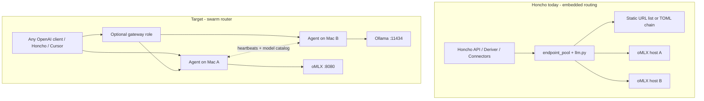
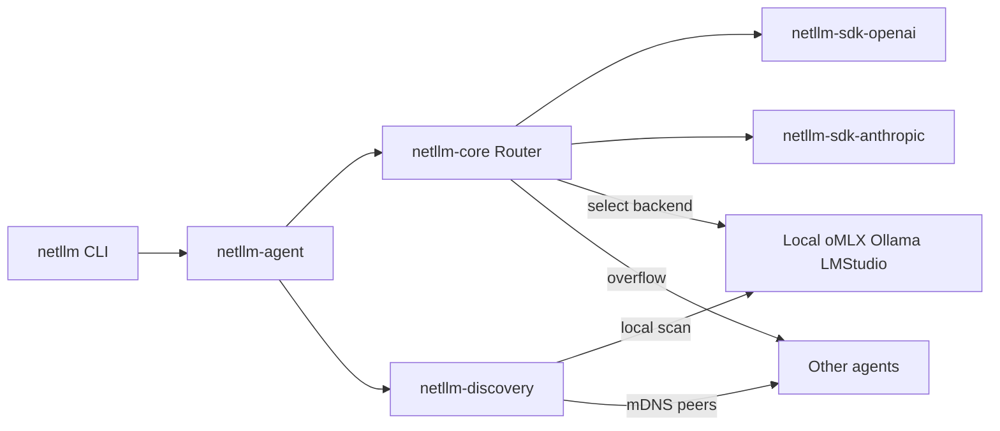

# Network LLM Router (Swarm + Optional Gateway)

## Context from Honcho (direct inspection)

Honcho already implements **client-side multi-endpoint routing** embedded in three places — not a network-wide service:

| Surface | Key files | What works today |
|---------|-----------|------------------|
| Core LLM failover/shard | [`src/llm/endpoint_pool.py`](src/llm/endpoint_pool.py), [`src/llm/routing_chain.py`](src/llm/routing_chain.py), [`src/llm/runtime.py`](src/llm/runtime.py) | `failover` (retry advances chain), `batch_shard` (round-robin indices), stable queue sharding via SHA256, 30s health cache, circuit breaker after 3 failures |
| Health probes | [`src/llm/local_health.py`](src/llm/local_health.py), [`src/routers/local_providers.py`](src/routers/local_providers.py) | `GET /v1/models`, auth-aware online detection, diagnose with 1-token inference + latency |
| Connector batch pool | [`connectors/_shared/llm.py`](connectors/_shared/llm.py), [`connector-runner/src/llm_pool.py`](connector-runner/src/llm_pool.py) | Comma-separated URLs, per-URL API keys, `batch_shard` with per-endpoint workers, failed-index-only retry |
| Admin UX | [`admin/pages/settings/providers.vue`](admin/pages/settings/providers.vue), [`admin/components/config/EndpointPoolRow.vue`](admin/components/config/EndpointPoolRow.vue) | Sortable chain, scan wizard, test/diagnose |



**Graphify note:** No [`graphify-out/`](graphify-out/) exists yet. During implementation Phase 0, run `/graphify` scoped to `src/llm/`, `connectors/_shared/llm.py`, `connector-runner/src/llm_pool.py`, and `src/routers/local_providers.py` to produce a persistent architecture map before extracting logic.

---

## Gaps Honcho does not cover (new project must solve)

1. **No LAN discovery** — scan only hits `localhost` / `host.docker.internal` ([`_KNOWN_LOCAL_PROVIDERS`](src/routers/local_providers.py)); backends must be manually listed (`LLM_OPENAI_COMPATIBLE_BASE_URLS`).
2. **No standalone proxy** — apps must embed routing libraries; there is no drop-in `OPENAI_BASE_URL=http://router:11400/v1`.
3. **Split health semantics** — core uses `/v1/models`; connectors use **TCP-only** ([`healthy_base_urls`](connectors/_shared/llm.py)) — inconsistent offline detection.
4. **No cross-machine coordination** — no shared model registry, in-flight load, or latency scores across hosts.
5. **No streaming gateway** — Honcho calls are mostly non-streaming batch; a router must proxy SSE cleanly.
6. **Anthropic is failover-only** — cloud row in chain, not a first-class proxied API surface for local agents.
7. **Triple duplication** — same concepts in `endpoint_pool`, `connectors/_shared/llm.py`, and admin pool JSON.

---

## Product shape

**Working name:** `netllm` (adjustable)

**Topology (your choice): swarm + optional gateway**

- **Default:** every host runs `netllm-agent` — discovers **local** inference servers, joins a **swarm** via LAN advertisement + configured peers, routes requests using swarm-wide backend catalog.
- **Optional gateway role:** one agent (user-configured) becomes the **only client-facing** OpenAI/Anthropic-compatible entrypoint; other agents remain workers. For homes without a designated admin, any agent can still serve local clients directly (`local_first` mode).

**Swarm data exchanged (minimal v1 protocol):**

- Agent identity, listen address, role (`peer` | `gateway`)
- Backend list: `{base_url, provider, models[], api_key_ref, health, latency_p50_ms, in_flight}`
- Periodic heartbeat (5–15s) + event on backend up/down
- Discovery transports (pluggable): **mDNS** (`_netllm._tcp`), **manual peers**, **optional subnet scan** for known ports (8080/11434/1234) on `/24`

---

## Monorepo package layout (maintainability + official SDKs)

Use **uv workspace** with independently versioned packages:

| Package | Responsibility | Upstream deps |
|---------|----------------|---------------|
| `netllm-core` | Config models, routing strategies, health cache, circuit breaker, batch shard planner, dedup ledger — **ported from** [`endpoint_pool.py`](src/llm/endpoint_pool.py) + [`local_health.py`](src/llm/local_health.py) | `httpx`, `pydantic` |
| `netllm-sdk-openai` | Thin adapter over **official** [`openai`](https://pypi.org/project/openai/) Python SDK — chat, embeddings, models list, streaming | `openai` (pinned, semver in its own pyproject) |
| `netllm-sdk-anthropic` | Thin adapter over **official** [`anthropic`](https://pypi.org/project/anthropic/) SDK — messages API, streaming | `anthropic` (pinned separately) |
| `netllm-discovery` | Local provider scan (oMLX/Ollama/LM Studio/custom), mDNS advertise/listen, peer registry | `zeroconf` (optional extra) |
| `netllm-agent` | FastAPI daemon: swarm API + OpenAI-compatible proxy + optional Anthropic proxy | `fastapi`, `uvicorn` |
| `netllm-cli` | User-facing CLI (`netllm` entry point) | `typer`, `rich` |

**SDK maintenance rule:** router business logic never hand-rolls OpenAI/Anthropic HTTP. All upstream calls go through `netllm-sdk-*`, which wrap official clients and normalize errors/timeouts. Bump `openai`/`anthropic` in those packages only; `netllm-core` stays stable.

---

## Agent architecture



**Request path (OpenAI-compat client → agent):**

1. Client `POST /v1/chat/completions` (or gateway receives it)
2. Resolve model → candidate backends swarm-wide where `model` is loaded
3. Apply strategy: `local_first` | `latency_weighted` | `least_load` | `failover` | `round_robin`
4. Execute via `netllm-sdk-openai` with connect/read timeouts (Honcho pattern: 5s connect, 120s read)
5. On failure: mark backend unhealthy, retry next candidate (dedup-safe for idempotent batch indices)
6. Stream: pass through SSE chunks without buffering full body

**Config file** (`~/.config/netllm/config.toml` or `/etc/netllm/config.toml`):

```toml
[agent]
listen = "0.0.0.0:11400"
role = "peer"  # peer | gateway
advertise = true

[discovery.local]
providers = ["omlx", "ollama", "lmstudio"]
custom_endpoints = ["http://127.0.0.1:8080/v1"]

[discovery.swarm]
peers = []  # optional static peers
mdns = true
subnet_scan = false  # opt-in; CIDR list

[routing]
default_strategy = "local_first"
allow_remote = true
require_same_model_for_shard = true

[[routing.backends]]  # optional manual override / pin
base_url = "http://192.168.1.50:8080/v1"
provider = "omlx"
api_key_env = "OMLX_API_KEY"
```

---

## CLI UX (install → use in 3 commands)

Distribution: `uv tool install netllm-cli` or `pipx install netllm-cli` (bundles agent).

| Command | Purpose |
|---------|---------|
| `netllm init` | Write default config, detect local providers, print next steps |
| `netllm discover` | Scan localhost + LAN; table of hosts/models/latency |
| `netllm serve` | Start agent (foreground; `--daemon` for launchd/systemd later) |
| `netllm status` | Swarm members, backends, health, in-flight, last latency |
| `netllm test [--model M] [--backend URL]` | Diagnose (models list + 1-token completion) — port [`diagnose_provider`](src/routers/local_providers.py) |
| `netllm gateway enable` | Flip local role to gateway + reload peers |
| `netllm config edit` | Open config in `$EDITOR` |
| `netllm doctor` | Common misconfigurations (bind address, firewall, auth keys) |

**Seamless client wiring:** document single env var:

```bash
export OPENAI_BASE_URL=http://127.0.0.1:11400/v1
export OPENAI_API_KEY=netllm-local   # passthrough / ignored by most local servers
```

Honcho migration (later): replace `routing_chain` rows with one base URL pointing at local agent/gateway.

---

## Honcho logic to port (reference, not fork)

Extract patterns — not Honcho imports — into `netllm-core`:

| Honcho source | Port as |
|---------------|---------|
| [`endpoint_pool.py`](src/llm/endpoint_pool.py) `healthy_chain_entries`, `plan_batch_shard`, `BatchDedupLedger`, circuit breaker | `RouterPool` + strategies |
| [`local_health.py`](src/llm/local_health.py) | `probe_openai_compat()` unified probe (replace connector TCP-only) |
| [`local_providers.py`](src/routers/local_providers.py) `_KNOWN_LOCAL_PROVIDERS`, `diagnose` | `LocalProviderScanner` |
| [`connectors/_shared/llm.py`](connectors/_shared/llm.py) batch worker pool + failed-index retry | `BatchExecutor` in core (optional; gateway can also stay request-at-a-time) |
| [`connector-runner/src/llm_pool.py`](connector-runner/src/llm_pool.py) per-URL API keys | `BackendCredentials` in config |

**Improve over Honcho (your stated wishes):**

- Latency EMA + in-flight counters drive routing (not just round-robin / static hash)
- Single health implementation everywhere
- Automatic model→backend index from discovery (no manual comma-separated URLs)
- Prometheus `/metrics` on agent (request count, latency histogram, backend health gauge)

---

## Swarm protocol (v1 — keep simple)

HTTP JSON between agents (no custom binary protocol in v1):

- `GET /netllm/v1/peers` — known swarm members (gateway aggregates)
- `GET /netllm/v1/backends` — merged catalog
- `POST /netllm/v1/heartbeat` — push local state (authenticated optional via shared cluster token)
- mDNS TXT records: `{role, version, listen_url}`

**Security defaults for home LAN:**

- Bind client API to `127.0.0.1` by default; `0.0.0.0` opt-in with warning
- Optional `cluster_token` for inter-agent auth
- Never log API keys; store key refs as env var names only

---

## Implementation phases

### Phase 0 — Validate + scaffold (1–2 days)

- Run `/graphify` on Honcho LLM routing files; capture god nodes / cross-community edges in plan doc
- Create new repo with uv workspace, CI (`ruff`, `pytest`, `basedpyright`)
- Copy/adapt unit tests from [`tests/unit/test_endpoint_pool.py`](tests/unit/test_endpoint_pool.py)

### Phase 1 — Single-host MVP (prove install path)

- `netllm-core` + `netllm-sdk-openai` + `netllm-discovery` (local only)
- `netllm-agent`: proxy `GET /v1/models`, `POST /v1/chat/completions` (+ streaming)
- Strategies: `failover`, `round_robin`
- CLI: `init`, `discover`, `serve`, `test`, `status`
- **Exit criteria:** point Cursor/Honcho at `localhost:11400/v1`; multi-local-port failover works

### Phase 2 — Swarm coordination

- mDNS + static peers + heartbeat merge
- Model catalog aggregation; `local_first` + `least_load`
- Gateway role flag; gateway-only client bind option
- CLI: `gateway enable`, swarm table in `status`

### Phase 3 — Anthropic + observability

- `netllm-sdk-anthropic`; proxy `POST /v1/messages` (or native Anthropic path behind feature flag)
- Latency-weighted routing using rolling stats from diagnose + live requests
- Prometheus metrics + optional JSON status export for dashboards

### Phase 4 — Honcho pilot (parallel track)

- Run Honcho stack with `OPENAI_BASE_URL` → local `netllm-agent`
- Compare connector batch throughput vs embedded [`connectors/_shared/llm.py`](connectors/_shared/llm.py)
- Document migration guide; **do not remove** Honcho embedded pool until parity checklist passes

---

## Parity checklist vs Honcho (must meet or exceed)

- [ ] Multi-endpoint failover on single request
- [ ] Batch-style parallelism across backends (shard or concurrent single requests)
- [ ] Failed-item-only retry (no duplicate completions)
- [ ] Per-endpoint API keys
- [ ] Health cache + circuit breaker
- [ ] Model list / diagnose / 1-token latency test
- [ ] **New:** LAN discovery + swarm routing without manual IP lists
- [ ] **New:** Drop-in OpenAI base URL for any client
- [ ] **New:** Streaming proxy

---

## Risks and mitigations

| Risk | Mitigation |
|------|------------|
| Swarm complexity early | Ship Phase 1 single-host first; swarm is additive |
| oMLX auth / bind quirks | Reuse Honcho diagnose hints; default `api_key_env` docs per provider |
| Model mismatch across shards | Enforce `require_same_model_for_shard` (from [`validate_shard_models`](src/llm/routing_chain.py)) |
| Firewall / mDNS blocked | Always support static `peers` list; subnet scan opt-in |
| SDK drift | Isolate in `netllm-sdk-*` packages with explicit semver pins and contract tests |

---

## Recommended repo location

Greenfield repository (e.g. `github.com/<you>/netllm`) — **not** inside Honcho monorepo initially. Honcho remains a reference implementation and first integration consumer per your **parallel_both** choice.
