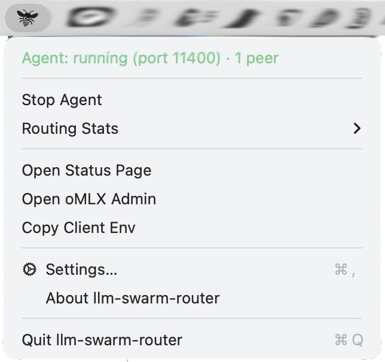
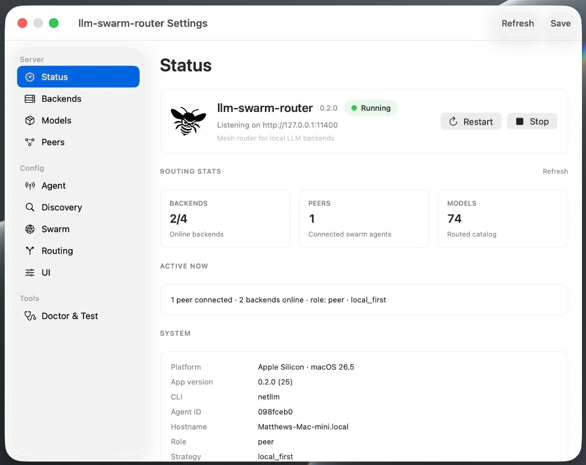

<p align="center">

```
 ███████╗██╗    ██╗ █████╗ ██████╗ ███╗   ███╗      ██╗     ██╗     ███╗   ███╗
 ██╔════╝██║    ██║██╔══██╗██╔══██╗████╗ ████║      ██║     ██║     ████╗ ████║
 ███████╗██║ █╗ ██║███████║██████╔╝██╔████╔██║█████╗██║     ██║     ██╔████╔██║
 ╚════██║██║███╗██║██╔══██║██╔══██╗██║╚██╔╝██║╚════╝██║     ██║     ██║╚██╔╝██║
 ███████║╚███╔███╔╝██║  ██║██║  ██║██║ ╚═╝ ██║      ███████╗███████╗██║ ╚═╝ ██║
 ╚══════╝ ╚══╝╚══╝ ╚═╝  ╚═╝╚═╝  ╚═╝╚═╝     ╚═╝      ╚══════╝╚══════╝╚═╝     ╚═╝

         ·  s w a r m   r o u t e r  ·
```

</p>

# llm-swarm-router

<p align="center">
  <a href="AGENTS.md"></a>
  <a href="docs/menubar-app.md"></a>
  <a href="docs/editor-integration.md"></a>
  <a href="./LICENSE"></a>
  <a href="https://www.python.org/downloads/"></a>
  <a href="https://platform.openai.com/docs/api-reference"></a>
</p>

**The mesh router for local LLM backends.** Run a lightweight agent on each machine — it finds oMLX, Ollama, and LM Studio on localhost, discovers sibling agents on your LAN, and exposes one stable endpoint for every editor and tool.

| API | Base URL |
|-----|----------|
| OpenAI-compatible | `http://<host>:11400/v1` |
| Anthropic Messages | `http://<host>:11400` (translated to local backends) |

Point **Cursor**, **Claude Code**, **Codex**, **Honcho**, or any compatible client at that URL. No cloud hop, no per-repo failover URLs, no lock-in to a single backend.

---

## Platform status

| Platform | Status | Install |
|----------|--------|---------|
| **macOS** (Apple Silicon) | **Available** — native menubar app + CLI | [DMG from Releases](https://github.com/matthewdcage/llm-swarm-router/releases) or build below |
| **macOS / Linux** (dev) | **Available** — Python agent + CLI from source | `uv sync` + `./netllm serve` |
| **Linux** (desktop) | **Coming** — systemd service, `.deb` / `.rpm` packages | Track [cross-platform plan](.cursor/plans/cross-platform_vllm_support_a4b73585.plan.md) |
| **Windows** | **Coming** — Windows service, MSI / winget | Same roadmap |

Linux and Windows already run the **agent and CLI from source** today; native installers, background services, and platform-tuned discovery defaults are in active development.

---

## macOS — install in one step

**Recommended for Mac users:** download, drag, open. No terminal setup required.

1. Download **`llm-swarm-router.dmg`** from [GitHub Releases](https://github.com/matthewdcage/llm-swarm-router/releases).
2. Open the DMG and drag **llm-swarm-router** to **Applications**.
3. Launch from Applications. The bee icon appears in the menu bar.
4. Complete the short welcome wizard (optional LAN mode, auto-start agent).

<p align="center">
  
  <br>
  <em>Menubar — agent status, start/stop, routing stats, copy client env, and Settings (⌘,).</em>
</p>

The app **starts the agent automatically**, **scans for local providers** (oMLX, Ollama, LM Studio), and **persists discovered URLs** to `~/.config/netllm/config.toml`. You do not need to run `netllm discover` manually.

If macOS blocks the first launch: right-click the app in Applications → **Open** once.

**Terminal:** After first launch, a CLI shim is available at `~/.config/netllm/bin/netllm` (`netllm status`, `netllm models`, etc.).

More detail: [docs/menubar-app.md](docs/menubar-app.md)

### Optional: Homebrew

```bash
brew tap matthewdcage/netllm https://github.com/matthewdcage/llm-swarm-router
brew install netllm
brew services start netllm
```

---

## CLI / source install (macOS & Linux)

For development, CI, or Linux hosts without the menubar app:

```bash
git clone https://github.com/matthewdcage/llm-swarm-router.git
cd llm-swarm-router
uv sync
./netllm init
./netllm serve          # agent on http://127.0.0.1:11400
```

The `./netllm` wrapper works **immediately** from the repo — no global install required.

**Verify** (second terminal, while `serve` is running):

```bash
scripts/agent-verify-setup.sh
export OPENAI_BASE_URL=http://127.0.0.1:11400/v1
export OPENAI_API_KEY=netllm-local
```

**Global CLI (optional):** `./netllm install` → `netllm` on PATH via `uv tool install`.

**Agent-assisted setup** (Cursor, Codex, Claude Code in this repo): `/netllm-setup` and `/netllm-connect` — see [AGENTS.md](AGENTS.md) and [docs/editor-integration.md](docs/editor-integration.md).

---

## Wire your editor

```bash
export OPENAI_BASE_URL=http://127.0.0.1:11400/v1
export OPENAI_API_KEY=netllm-local
```

**Claude Code / native Anthropic clients:**

```bash
export ANTHROPIC_BASE_URL=http://127.0.0.1:11400
export ANTHROPIC_API_KEY=netllm-local
```

Pick a model ID from `./netllm models` (or the app **Settings → Models** tab). Full per-editor steps: [docs/editor-integration.md](docs/editor-integration.md).

---

## What you get

### macOS Settings

<p align="center">
  
  <br>
  <em>Settings — live status, backend/peer/model counts, restart/stop, and full config (Discovery, Swarm, Routing, Doctor).</em>
</p>

<table>
<tr><td><b>Native macOS app</b></td><td>Menubar supervisor, welcome wizard, Settings UI (status, backends, models, peers, routing, discovery, doctor). Embeds Python agent — no separate <code>uv</code> install for end users.</td></tr>
<tr><td><b>Automatic local discovery</b></td><td>Probes oMLX (<code>:8080</code>, <code>:8088</code>, <code>:8081</code>), Ollama (<code>:11434</code>), LM Studio (<code>:1234</code>). Per-machine overrides via <code>discovery.provider_urls</code> in config or Settings.</td></tr>
<tr><td><b>Dual API surface</b></td><td>OpenAI chat/models/streaming plus Anthropic Messages API with translation to OpenAI-compatible backends.</td></tr>
<tr><td><b>LAN swarm</b></td><td>Each host is a peer agent. mDNS (<code>_netllm._tcp</code>), subnet scan, and static <code>swarm.peers</code> for multi-Mac meshes.</td></tr>
<tr><td><b>Routing strategies</b></td><td><code>local_first</code>, <code>failover</code>, <code>round_robin</code>, <code>least_load</code>, <code>latency_weighted</code>, <code>batch_shard</code>.</td></tr>
<tr><td><b>Health & observability</b></td><td>Per-backend health cache, circuit breaker, Prometheus <code>/metrics</code>, <code>netllm test</code> latency probes, <code>netllm doctor</code>.</td></tr>
<tr><td><b>Honcho-ready</b></td><td>Drop-in mesh router for Honcho deriver/dialectic flows — <a href="docs/honcho-integration.md">Honcho integration</a>.</td></tr>
<tr><td><b>Agent-native docs</b></td><td><a href="AGENTS.md">AGENTS.md</a>, <a href=".agents/skills/">skills</a>, Claude Code slash commands for setup, connect, swarm, and troubleshoot.</td></tr>
</table>

---

## How the swarm fits together

```
  ┌──────────────┐   mDNS (_netllm._tcp)   ┌──────────────┐
  │  MacBook     │◄───────────────────────►│  Mac mini    │
  │  llm-swarm-  │                         │  llm-swarm-  │
  │  router app  │                         │  router app  │
  └───┬──────┬───┘                         └───┬──────┬───┘
      │      │                                 │      │
   oMLX   Ollama                           oMLX   Ollama
  :8080+  :11434                         :8088   :11434
      │      │                                 │      │
      └──────┴─────────── :11400/v1 ───────────┴──────┘
                         │
              Cursor · Claude Code · Honcho · curl
```

| Discovery | When |
|-----------|------|
| **Automatic** | Agent scans on every start (app or `netllm serve`) |
| **mDNS** | Default on home/office LAN (`serve --host 0.0.0.0`) |
| **Subnet scan** | `netllm peers --subnet-scan` when multicast is blocked |
| **Manual** | `swarm.peers` in config, Settings, or `peers --save` |

Config: `~/.config/netllm/config.toml` — see [config.example.toml](config.example.toml).

---

## CLI quick reference

```bash
./netllm serve             # foreground agent (dev/CI/Linux)
./netllm serve --host 0.0.0.0   # LAN + swarm
./netllm start|stop|restart     # background (macOS app / Homebrew)
./netllm status            # backends, health, peers
./netllm models            # routed catalog
./netllm models --lan      # include remote LAN agents
./netllm peers             # mDNS browse
./netllm discover          # manual rescan (optional; agent auto-discovers)
./netllm test              # 1-token latency probe
./netllm test --api anthropic
./netllm gateway           # promote to LAN entrypoint
./netllm doctor            # PATH, mDNS, port, backend checks
```

---

## Build the macOS app (developers)

Requirements: macOS 15+, Apple Silicon, [uv](https://docs.astral.sh/uv/), Xcode CLT or full Xcode (actool optional — iconutil fallback on CLT-only Macs).

```bash
uv sync
apps/netllm-mac/Scripts/build.sh release
packaging/scripts/create-dmg.sh    # → dist/llm-swarm-router.dmg
```

**Test like an end user** (build → Applications → launch):

```bash
./scripts/emulate-user-install-mac.sh
```

Python layer packaging (venvstacks): [packaging/README.md](packaging/README.md)

---

## Packages

| Package | Role |
|---------|------|
| **netllm-core** | Routing, health cache, config |
| **netllm-sdk-openai** | OpenAI SDK upstream adapter |
| **netllm-sdk-anthropic** | Anthropic SDK upstream adapter |
| **netllm-discovery** | Local scan, swarm registry, mDNS |
| **netllm-agent** | FastAPI — `/v1/*`, `/netllm/v1/*`, `/metrics` |
| **netllm-cli** | Typer CLI |
| **netllm-mac** | Native macOS menubar app (`apps/netllm-mac/`) |

Architecture: [docs/architecture-reference.md](docs/architecture-reference.md)

---

## Development

```bash
uv sync
uv run pytest tests/ -v
uv run ruff check packages/ tests/
```

After editing agent skills: `scripts/sync-agent-skills.sh`

---

## License

MIT — see [LICENSE](LICENSE).
