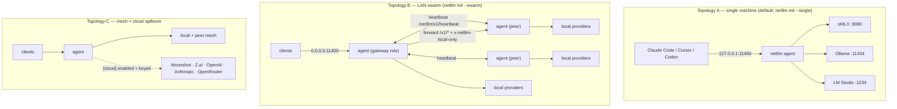
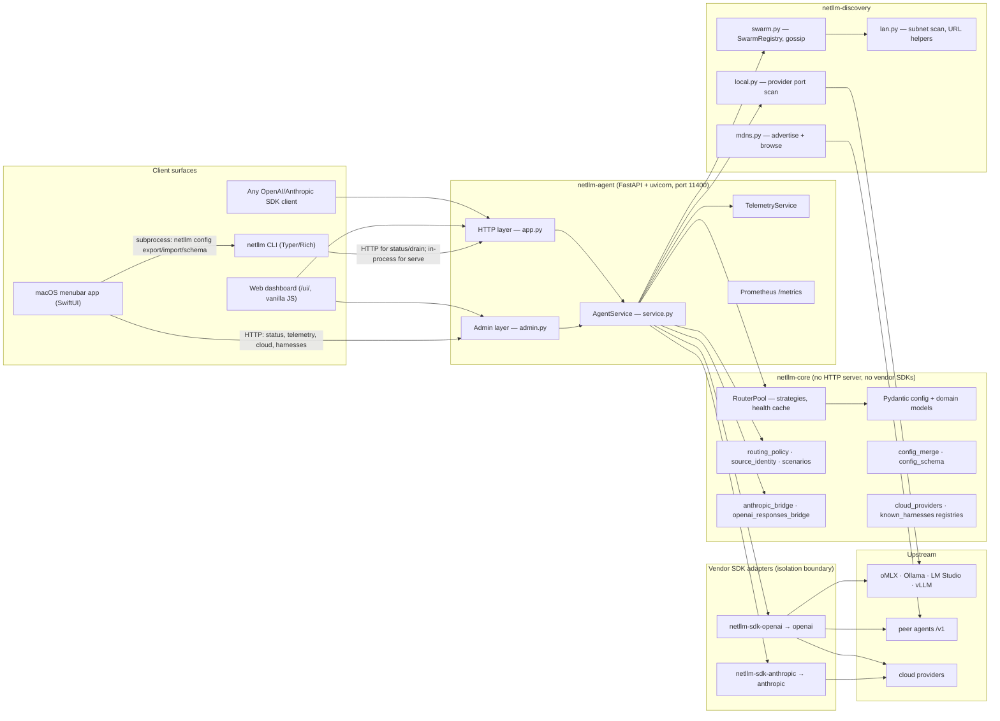

# 01 · System overview

## What the product is

**netllm** is a per-host daemon that turns the LLM servers on your machines into a single
OpenAI- and Anthropic-compatible endpoint. Each host runs one agent. The agent:

1. **Discovers** local inference servers (oMLX, Ollama, LM Studio, vLLM) by probing known ports.
2. **Discovers** sibling agents on the LAN (mDNS, static peers, optional subnet scan).
3. **Exposes** two client-facing API dialects on one port — `http://<host>:11400/v1` (OpenAI:
   chat, responses, embeddings, models) and `http://<host>:11400/v1/messages` (Anthropic Messages).
4. **Routes** each request to a backend using a configurable strategy, translating between
   dialects where the chosen backend speaks the other one.
5. **Falls back** to configured cloud providers when local capacity is unavailable (opt-in).

The value proposition is that any tool that accepts `OPENAI_BASE_URL` or `ANTHROPIC_BASE_URL`
— Claude Code, Codex CLI, Cursor, Gemini CLI, Honcho, custom harnesses — points at netllm once
and transparently gets the whole fleet.

## Deployment topologies

Every agent is architecturally identical. `agent.role` (`peer` | `gateway`) only affects
(a) whether peers adopt this agent's `default_strategy` via `routing.follow_gateway`, and
(b) doctor warnings. There is no leader election, no shared state store, no quorum.

## Container / component view

### Layering rule that is actually enforced

`netllm-core` must never import `openai` or `anthropic`; only the two `netllm-sdk-*` packages
may. This is enforced by a test (`tests/test_sdk_isolation.py`) and a dedicated CI job
(`./scripts/ci.sh sdk`). It is the cleanest boundary in the codebase and it holds.

## Tech stack

| Layer | Choice | Version floor |
|-------|--------|---------------|
| Language | Python | ≥ 3.11 (`tomllib`) |
| Workspace / resolver | uv workspace monorepo, `uv.lock` committed | — |
| Build backend | hatchling (all 6 packages) | — |
| HTTP server | FastAPI + uvicorn[standard] | 0.115 / 0.32 |
| HTTP client | httpx (async + sync) | 0.28 |
| Config models | pydantic v2 (+ tomli-w) | 2.10 |
| CLI | Typer + Rich | 0.15 / 13.9 |
| Metrics | prometheus-client | 0.21 |
| Service discovery | zeroconf | 0.132 |
| Vendor SDKs | `openai`, `anthropic` (isolated) | ≥2.0,<3 / ≥0.100,<1 |
| macOS app | Swift 5.9 tools, SwiftUI, macOS 14+ target | — |
| macOS Python embedding | venvstacks | 0.5 |
| Dashboard | vanilla HTML/CSS/JS, no build step, no framework | — |
| Tests | pytest + pytest-asyncio (`asyncio_mode = auto`) | 8.0 / 0.24 |
| Lint / types | ruff (E,F,I,UP; line 88) · basedpyright (standard) | 0.8 / 1.20 |

Notably **absent by design**: no database, no message broker, no external cache, no
container runtime requirement. All state is either in-process or a single TOML file.

## State: where things live

| State | Location | Lifetime |
|-------|----------|----------|
| User config | `~/.config/netllm/config.toml` (mode 0600 on POSIX) | Durable |
| Backend pool + health cache | `RouterPool` in-process | Process |
| Peer registry | `SwarmRegistry.peers` in-process | Process, pruned at `peer_stale_after_s` |
| Local provider scan | `AgentService._local_scan_cache`, 10 s TTL | Process |
| Upstream SDK clients | `AgentService._upstream_cache`, ≤64 entries | Process |
| Batch shard assignments | `BatchRequestLedger`, ≤8192 entries | Process |
| Drain flag | `AgentService.draining` | Process (deliberately not persisted) |
| Session telemetry | `TelemetryService._session` | Process |
| All-time telemetry | `~/.config/netllm/stats.json` | Durable |
| Prometheus counters | prometheus-client registry | Process |
| Agent log | `<log_dir>/agent.log` | Durable, rotated at 10 MB × 3 |

## Surfaces exposed on port 11400

| Route | Auth | Purpose |
|-------|------|---------|
| `GET /` | none | JSON service card, or 307 → `/ui/` for browsers |
| `GET /health` | none | Liveness (used by subnet scan) |
| `GET /metrics` | none | Prometheus exposition |
| `GET /ui/*` | none | Bundled dashboard (static mount) |
| `POST /v1/chat/completions` | optional cluster token | OpenAI chat, streaming or not |
| `POST /v1/responses` | optional cluster token | OpenAI Responses (Codex CLI) |
| `POST /v1/embeddings` | optional cluster token | OpenAI embeddings |
| `POST /v1/messages` | optional cluster token | Anthropic Messages, streaming or not |
| `GET /v1/models` | optional cluster token | Aggregated catalog |
| `GET /netllm/v1/status` | cluster token if set | Swarm status snapshot. `?scan=1` rescans providers, `?probe=1` re-probes local backends, `?probe_peers=1` re-probes peer reachability |
| `GET /netllm/v1/peers`, `/backends` | cluster token if set | Read-only debug |
| `POST /netllm/v1/heartbeat` | cluster token if set | Peer gossip ingress |
| `GET /netllm/v1/telemetry` | cluster token if set | Dashboard/menubar telemetry |
| `GET /netllm/v1/{doctor,version,config,config/schema,logs,harnesses}` | local **or** cluster token | Admin reads |
| `GET /netllm/v1/cloud/providers[/{id}/models]` | local or token | Cloud registry + live catalog probe |
| `GET /netllm/v1/update/check` | local or token | GitHub release check |
| `GET /netllm/v1/client-env` | none | Env-var snippet for editor wiring |
| `POST /netllm/v1/admin/{config,discover,peers-scan,drain}` | local or token | Admin writes |

"Optional cluster token" on `/v1/*` = enforced only when
`swarm.require_token_for_inference = true` **and** a `swarm.cluster_token` is set.
"cluster token if set" on the `/netllm/v1/*` read routes = enforced whenever a token
exists, no second flag needed. Loopback clients are always exempt from both, and with no
token configured nothing is gated — the zero-config path is unchanged.

## Codebase size

| Area | Files | Lines |
|------|-------|-------|
| `packages/` Python (6 packages) | 52 | 13,924 |
| ↳ largest: `netllm_agent/service.py` | 1 | 2,246 |
| ↳ second: `netllm_cli/main.py` | 1 | 2,141 |
| `apps/netllm-mac/Sources` Swift | 45 | ~7,500 |
| ↳ largest: `SettingsWindowView.swift` | 1 | 1,244 |
| Bundled dashboard (JS/CSS/HTML) | 3 | 3,457 |
| Tests (`tests/` + SDK package tests) | 63 | 642 passing |

Two 2 kLOC modules (`service.py`, `main.py`) carry most of the complexity and most of the
findings in [07](07-findings-register.md); both are flagged for decomposition (F-24).
