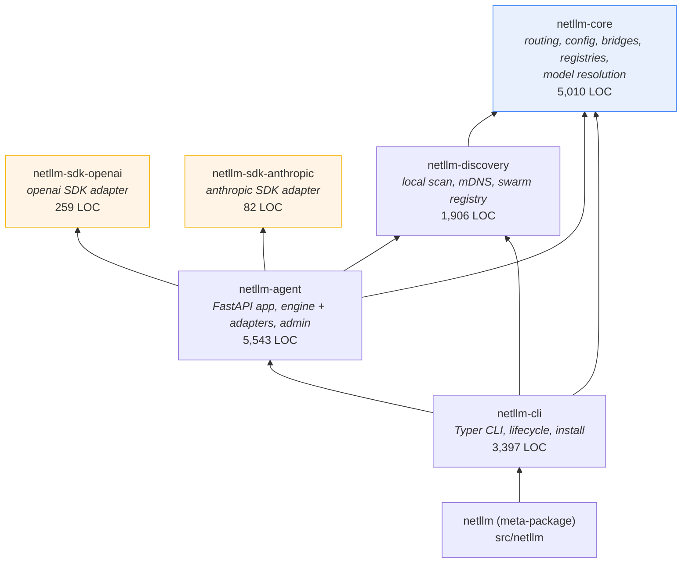
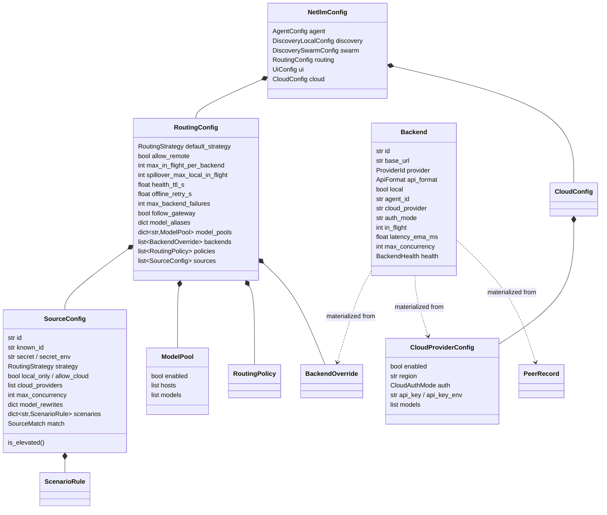
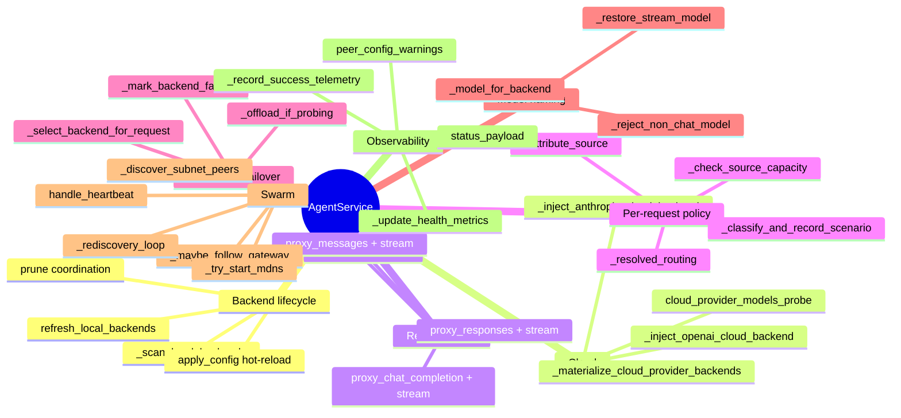
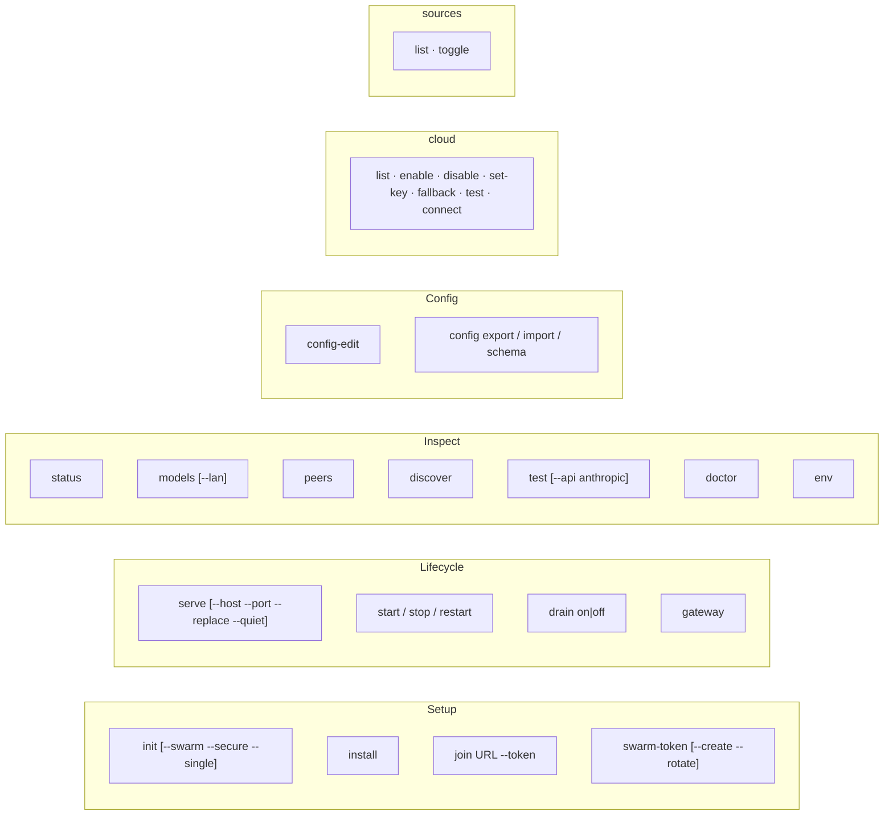
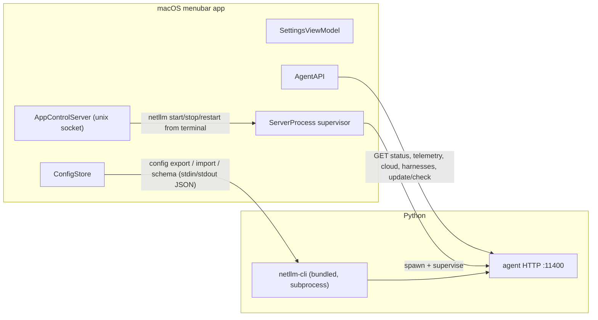

# 02 · Component architecture

## Package dependency graph

The graph is acyclic and the SDK isolation boundary is real. Two observations:

- `netllm-cli` depends on `netllm-agent`, which pulls FastAPI, uvicorn, prometheus-client
  and both vendor SDKs into every CLI-only install. This is deliberate (`netllm serve` runs
  the agent in-process) but means there is no lightweight "client-only" install path (F-25).
- `netllm-core` depends on nothing but httpx/pydantic/tomli-w. It is genuinely portable
  and is the right home for anything reusable.

## netllm-core — the domain

| Module | LOC | Responsibility |
|--------|-----|----------------|
| `models.py` | 597 | All pydantic config models + `Backend`/`BackendHealth` domain types, protocol header constants, `load_config`/`save_config`, `ensure_lan_mesh_defaults` |
| `pool.py` | 647 | `RouterPool`: candidate selection, 8 routing strategies, health cache, in-flight ledger, model-alias/pool resolution, rendezvous sharding |
| `anthropic_bridge.py` | 461 | Anthropic Messages ⇄ OpenAI chat translation, including SSE stream translation |
| `openai_responses_bridge.py` | 423 | OpenAI Responses ⇄ chat translation (Codex CLI surface) |
| `update.py` | 328 | GitHub release check, asset selection per install method, SHA256 sidecar handling |
| `health.py` | 260 | OpenAI and Anthropic reachability probes (async + sync), 1-token diagnose |
| `config_merge.py` | 244 | **The single shared merge implementation** for both config write paths |
| `install_detect.py` | 202 | app-bundle / Homebrew / systemd / Windows-service / source detection |
| `routing_policy.py` | 191 | `resolve_routing()` — merges globals, policies, source, scenario, headers |
| `cloud_providers.py` | 176 | Static registry of 5 cloud providers (endpoints, auth modes, catalogs) |
| `config_schema.py` | 169 | Walks pydantic models → generic form schema for UI clients |
| `source_identity.py` | 131 | `resolve_source()` — header → virtual key → User-Agent → default |
| `scenarios.py` | 129 | Heuristic classification: long_context / web_search / think / background |
| `known_harnesses.py` | 87 | Static registry of 6 known CLIs |
| `capabilities.py` | 68 | Name-heuristic model capability (chat/embedding/audio/rerank/other) |
| `platform.py` | 63 | OS-specific paths, `local_admin_client_hosts()` |
| `config.py` | 41 | Pure re-export shim over `models.py` |
| `harness_detection.py` | 39 | `shutil.which` detection with 5-min TTL cache |
| `sdk_versions.py` / `version.py` | 44 | Installed-version reporting |

### Domain model

**Key insight:** `Backend` is a *runtime* type that is never persisted. It is materialized
from three sources every refresh cycle — the local provider scan, `[[routing.backends]]`
overrides, and peer heartbeats — plus two ephemeral cloud paths. This is why pruning
(`prune_local_provider_rows`, `prune_peer_rows`, `prune_cloud_provider_rows`) exists and
why in-place field updates in `merge_backends` matter (see F-03).

### Three overlapping model-name mechanisms

This is the single most confusing part of the domain for a new reader:

| Mechanism | Matched against | Effect |
|-----------|-----------------|--------|
| `routing.model_aliases` | the **requested** name | canonical name → list of provider-specific IDs |
| `routing.model_pools` | the **host**, not the name | any request name may run on that host, using whatever pool-allowed model it serves |
| `sources[].model_rewrites` | the **requested** name, per caller | rewritten before aliases/pools are consulted |
| `sources[].scenarios[x].model` | the classified scenario | overrides everything above for that scenario |

Resolution order in `AgentService`: `model_rewrites` → `scenario.model` → capability guard →
`resolve_routing` → candidate collection (aliases, then pools) → `_model_for_backend`
(aliases exact → tag-prefix → case-folded → `resolve_via_pool`).

`routing-hardening-plan.md` §Phase 4 already states the intent to fold `model_pools` into a
future `model_groups`; until then, three name mechanisms plus a fourth (`model_groups`) is
a real simplification target (F-23).

## netllm-discovery

| Module | LOC | Responsibility |
|--------|-----|----------------|
| `local.py` | 610 | Provider port scan, URL normalisation, `Backend` materialisation, all oMLX admin/telemetry probing |
| `lan.py` | 366 | Loopback/own-URL detection, subnet CIDR scan, mDNS browse (sync), `discover_lan_agents` aggregation |
| `mdns.py` | 298 | zeroconf advertiser + browser, `ServiceInfo` encode/decode |
| `swarm.py` | 235 | `SwarmRegistry`, `PeerRecord`, heartbeat gossip loop, peer → `Backend` materialisation |
| `runtime.py` | 142 | Listen-port conflict detection, human-readable hints, `stop_netllm_on_port` |
| `agent_lock.py` | — | Cross-platform flock singleton lock (`agent.lock` under state dir) |
| `process_util.py` | 160 | Port ownership / PID inspection for `serve --replace` |

`local.py` carries all oMLX-specific admin/telemetry probing (~280 lines of the 610). That is
provider-specific knowledge sitting in a package named "discovery" — a cohesion smell, not a
defect (F-26).

## netllm-agent

| Module | LOC | Responsibility |
|--------|-----|----------------|
| `service/` | 3,570 | The `AgentService` mixin composition — 16 modules, table below |
| `app.py` | 548 | FastAPI factory, route definitions, exception → HTTP status mapping, static mount |
| `admin.py` | 511 | Loopback/token-gated admin helpers: doctor, config summary, patch save, peers-scan, log tail, registries |
| `telemetry.py` | 304 | Session/all-time counters, oMLX telemetry proxy, ring-buffer history |
| `shard.py` | 145 | Shard-context extraction and the bounded batch ledger |
| `candidates.py` | 120 | `CandidateSchedule` — primary + extras + fallback tiers + `max_attempts` |
| `taxonomy.py` | 108 | Error taxonomy and exhaustion classification |
| `errors.py` | 90 | Per-surface wire error envelopes (OpenAI / Anthropic shapes) |
| `request_plan.py` | 83 | `RequestPlan` (frozen) + `Surface` |
| `metrics.py` | 58 | 7 Prometheus collectors |
| `static/` | 3,613 | Bundled dashboard (`dashboard.js` alone is 2,825 lines — F-54) |

### The `service/` package (F-26)

| Module | LOC | Responsibility |
|--------|-----|----------------|
| `surfaces/base.py` | 486 | `SurfaceAdapter` protocol, `BaseAdapter`, the two dialect adapters, SSE restore helpers |
| `engine.py` | 469 | `run_with_failover`, `open_stream`, `StreamSession` — **the only failover loop** |
| `policy.py` | 350 | Source attribution, scenario classification, routing resolution, admission, guards |
| `cloud.py` | 308 | Legacy cloud injection + `[cloud.providers.*]` materialisation |
| `surfaces/messages.py` | 282 | `MessagesAdapter`: both dialect arms, fallback tier, mid-stream error frame |
| `swarm_tasks.py` | 274 | mDNS, rediscovery, subnet scan, heartbeat, gateway follow |
| `backends.py` | 268 | Refresh/scan, prune, upstream construction, peer-forward headers |
| `selection.py` | 259 | `_select_backend_for_request` + `CandidateSchedule` construction |
| `accounting.py` | 211 | `AttemptRecorder` — **the only accounting writer** |
| `core.py` | 140 | `__init__`, `apply_config`, `SourceCapacityExceeded` |
| `status.py` | 134 | Status payload, telemetry sinks, health metrics |
| `surfaces/chat.py` | 101 | `ChatAdapter` + the chat entry points |
| `surfaces/responses.py` | 80 | Responses ⇄ chat edge translation over `ChatAdapter` |
| `__init__.py` | 79 | Mixin composition; re-exports `AgentService`, `SourceCapacityExceeded`, `LEGACY_CLOUD_BACKEND_IDS` |
| `surfaces/embeddings.py` | 79 | `EmbeddingsAdapter` incl. the capability guard |
| `surfaces/__init__.py` | 50 | `adapter_for(service, surface)` |

### AgentService responsibilities (historical — why it was 2.1 kLOC)

> The mindmap below describes the **pre-split** `service.py`. It is kept because
> it is the clearest statement of the nine responsibilities the package now
> separates; map each branch to a module in the table above.

Nine distinct responsibilities in one class, and the four proxy paths shared a
near-identical ~70-line acquire/call/account/failover loop copy-pasted four times.
**RESOLVED (F-24/F-26):** the loop exists once in `service/engine.py`, the per-surface
variance is the `SurfaceAdapter` protocol, and accounting is written in exactly one place
(`AttemptRecorder`). Measured across the split: cross-module call edges 129 → 33,
multi-writer shared-state groups 12 → 0, projected module cycles 2 → 0
(`scripts/analyze-module-graph.py`).

## netllm-cli

| Module | LOC | Responsibility |
|--------|-----|----------------|
| `commands/` | 2,303 | 10 modules, one per command group: `_common`, `init_install`, `join_swarm`, `observe`, `serve_lifecycle`, `diagnose`, `config_io`, `cloud`, `sources` |
| `main.py` | 80 | Typer wiring only — registers the command modules and the `config`/`cloud`/`sources` sub-apps |
| `ui.py` | 314 | Rich rendering helpers (tables, panels, hint blocks) |
| `install.py` | 196 | Global CLI install via `uv tool install`, shell PATH wiring |
| `oauth_pkce.py` | 143 | OpenRouter OAuth PKCE flow with localhost callback |
| `lifecycle/` | 275 | Per-channel start/stop/restart: macOS app control socket, Homebrew, systemd, Windows `sc.exe` |
| `config_json.py` | 46 | `config export` / `config import` — the macOS app's save path |
| `install_detect.py` | 35 | Re-export shim over `netllm_core.install_detect` (F-55) |

### CLI command surface

`config export|import|schema` are machine-facing (stdout JSON / stdin JSON) and exist purely
so the macOS app can read and write config without the agent running.

## The three client surfaces and how they reach the agent

The macOS app deliberately uses **two** channels: config read/write goes through the bundled
CLI (works when the agent is stopped), everything live goes over HTTP. That split is
documented in `ConfigStore.swift` and is sound — but it is also the reason the elevated-source
security check is enforced on only one of the two write paths (F-02).

## Test topology

| Suite | Where | Runs in |
|-------|-------|---------|
| Cross-package integration (61 files) | `tests/` | `ci.sh test` (Ubuntu + Windows) |
| SDK adapter contracts | `packages/netllm-sdk-*/tests/` | `ci.sh sdk` (Ubuntu) |
| Two-agent end-to-end | `tests/test_e2e_two_agents.py` | `ci.sh test` |
| Bundled install scripts (shell) | `tests/test_bundled_install_scripts.sh` | manual / pre-release |
| macOS menubar e2e + lifecycle | `scripts/test-menubar-*.sh` | `menubar-lifecycle` job (macos-14) |

584 tests pass in ~50 s. Coverage is genuinely good on routing, config merge, source identity,
scenarios, cloud, and swarm URLs. The gaps that matter are listed as F-27.
