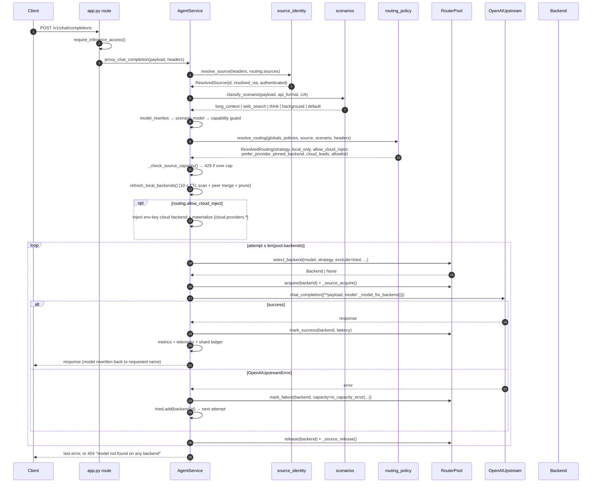
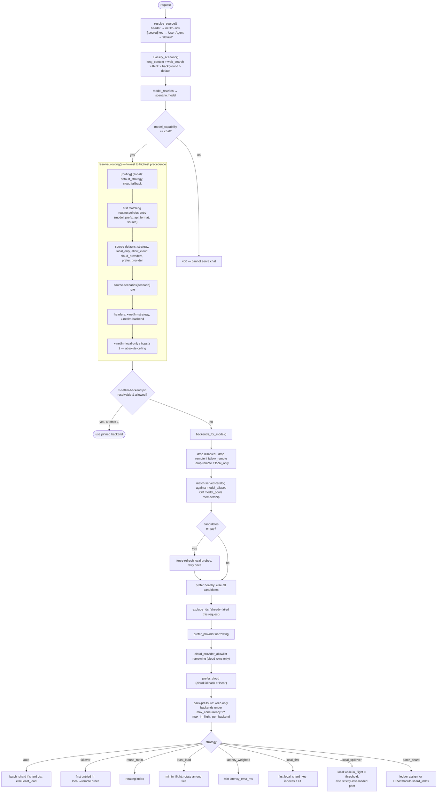
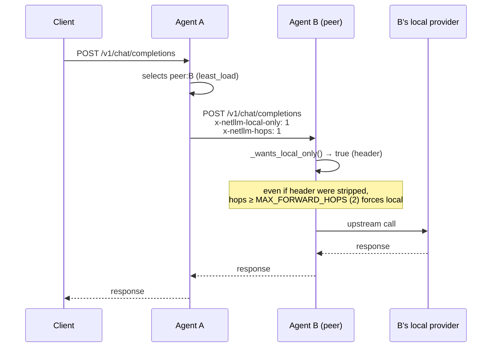
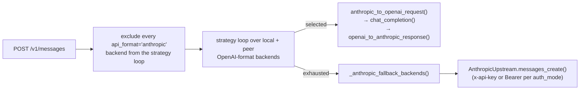

# 03 · Request lifecycle and routing

## The four proxy surfaces

| Route | Entry point | Translation |
|-------|-------------|-------------|
| `POST /v1/chat/completions` | `proxy_chat_completion[_stream]` | none (native) |
| `POST /v1/responses` | `proxy_responses[_stream]` | Responses ⇄ chat at the edge, then reuses the chat path verbatim |
| `POST /v1/embeddings` | `proxy_embeddings` | none; Anthropic-format backends pre-excluded |
| `POST /v1/messages` | `proxy_messages[_stream]` | Messages ⇄ chat per selected backend; Anthropic-native backends called directly |

The Responses surface exists because Codex CLI removed Chat Completions support for custom
providers (Feb 2026); netllm translates once at the edge so every downstream behaviour —
source identity, per-source routing, scenarios, capacity, failover — is shared.

## End-to-end sequence (non-streaming chat)

## Routing decision flow

### Strategy semantics cheat sheet

| Strategy | Balances by | Peer usage | Typical use |
|----------|-------------|------------|-------------|
| `local_first` | nothing | only if no local backend | single machine (default) |
| `local_spillover` | local in-flight threshold | only when local ≥ threshold **and** peer strictly less loaded | LAN default (auto-applied once on LAN bind) |
| `least_load` | live in-flight, ties rotated | full | busy mixed fleet |
| `latency_weighted` | EMA latency | full | heterogeneous hardware |
| `round_robin` | call count | full | even, model-identical fleet |
| `failover` | preference order | on failure | deterministic primary/secondary |
| `batch_shard` | shard key (HRW or modulo) | full | connector/batch workloads |
| `auto` | shard ctx → `batch_shard`, else `least_load` | full | recommended general default |

`batch_shard` without shard context degrades to `round_robin` and increments
`shardless_fallbacks` (surfaced in `/netllm/v1/status` and telemetry) — a deliberate
observability fix for a real field incident.

## Failover semantics

- **Retry budget** = `max(len(pool.backends), 1)`; every failed backend id is added to
  `tried` and excluded from subsequent selection, so no attempt is ever burnt twice.
- **Capacity vs hard failure.** `is_capacity_error()` classifies 409/429/503/507 and known
  body markers (`prefill_memory_exceeded`, `memory pressure`, `is busy`, `rate limit`) as
  *full now, not broken*: the backend is excluded for this request only and is **not** counted
  toward the offline trip. This prevents a loaded-but-working machine from being blackholed
  for `offline_retry_s` while its work piles onto survivors.
- **Load-aware strategies keep balancing on retries.** `least_load`, `latency_weighted`,
  `round_robin`, `local_spillover` are not downgraded to `failover` on attempt 2+.
- **Streaming is not retried after first byte.** Once any chunk has reached the client,
  a failure emits an SSE error frame and ends the stream rather than replaying a second
  response into the same stream. Correct, and non-obvious.

## Loop prevention across the mesh

Two independent guards (header + hop counter) mean a peer that ignores or strips
`x-netllm-local-only` still cannot ping-pong the request.

## Anthropic Messages path

`proxy_messages` runs the **same** strategy loop as chat completions over the OpenAI-format
mesh, then falls back to Anthropic-format backends as a final tier:

This ordering is deliberate: the Anthropic cloud must never shadow the free local mesh in a
rotation. Streaming mirrors it with an explicit `candidates_exhausted` / `fallback_iter`
state machine.

`anthropic_bridge` translates system prompts, multi-block content, tool definitions,
`tool_choice`, tool results, and — for streaming — synthesises `message_start`,
`content_block_start/delta/stop`, `message_delta`, `message_stop` events including
`tool_use` blocks. It imports no vendor SDK.

## Concurrency accounting

Three independent counters gate a request:

| Counter | Scope | Enforced in | Over-limit behaviour |
|---------|-------|-------------|----------------------|
| `Backend.in_flight` vs `max_concurrency` ?? `routing.max_in_flight_per_backend` | per backend row | `pool.select_backend` | prefer another backend; if all saturated, proceed anyway |
| `agent.max_concurrency` | per machine, self-declared | broadcast via heartbeat → copied onto the peer's `Backend.max_concurrency` on every other agent | peers stop selecting it |
| `sources[].max_concurrency` | per calling harness | `_check_source_capacity` | **HTTP 429**, no queuing |

Peer in-flight is heartbeat-reported plus this agent's own un-acked forwards
(`RouterPool._own_peer_hops`), so load is visible between heartbeats.

## Where the event loop is at risk

The code carefully offloads *selection* to a worker thread only when a probe could fire
(`_offload_if_probing` → `pool.any_health_stale()`). But `_update_health_metrics()` — called
from `refresh_local_backends()` on **every** request and again in the `finally` of every
attempt — iterates all backends calling `RouterPool.is_healthy()`, which performs
**synchronous httpx calls on the event loop** when an entry is stale. This inverts the
intent of the offload guard. See F-04.
