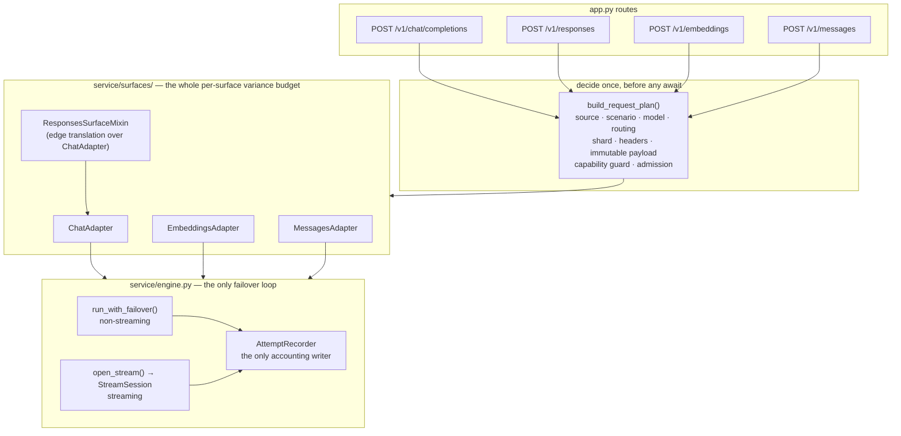
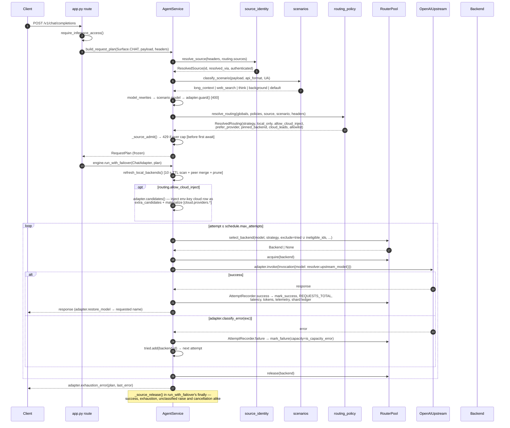
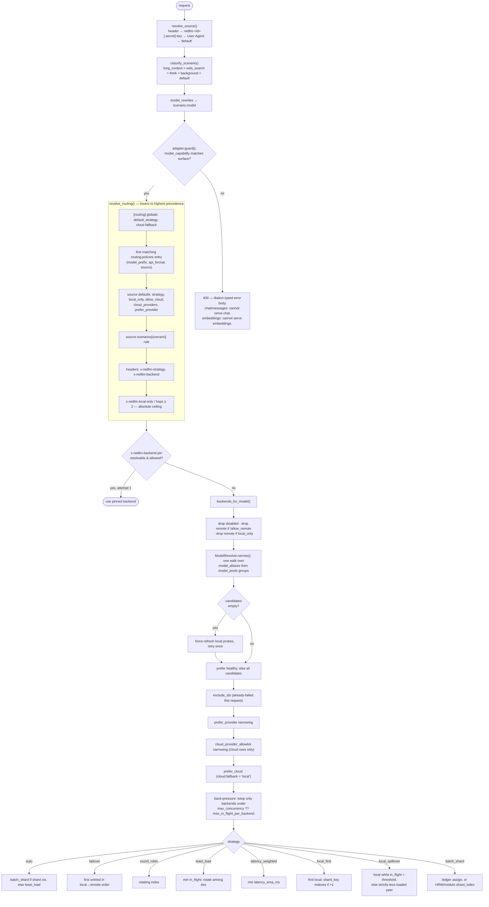
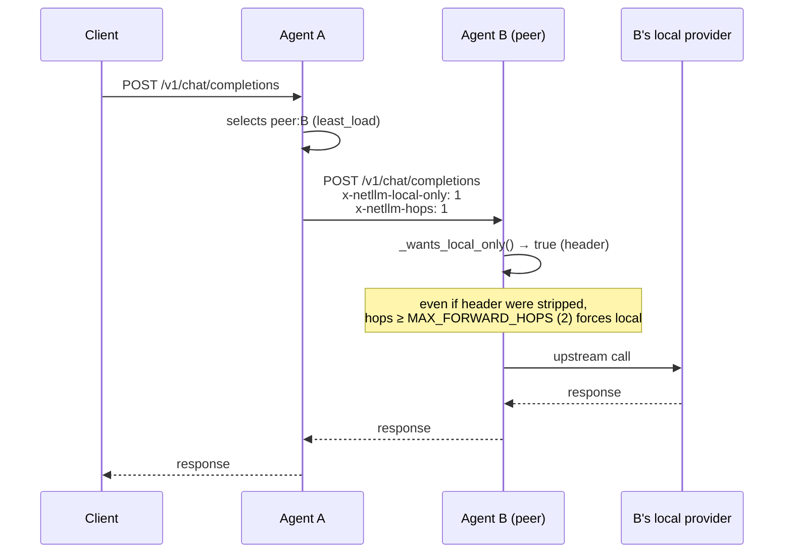
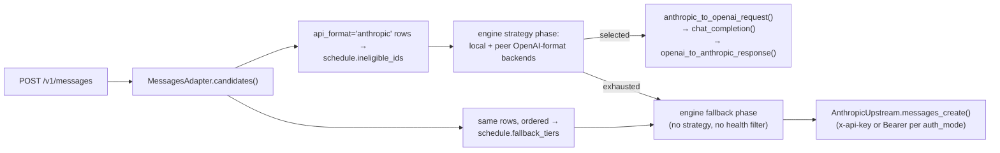

# 03 · Request lifecycle and routing

## Architecture: one engine, four surface adapters

There is **exactly one failover loop** in the codebase. Until the F-24/F-25/F-26
consolidation there were five — one hand-copied into each proxy method — and the
divergences between them are catalogued cell-by-cell in
[refactor/behavior-matrix.md](refactor/behavior-matrix.md). They are gone.

| Route | Adapter | Translation |
|-------|---------|-------------|
| `POST /v1/chat/completions` | `ChatAdapter` (`surfaces/chat.py`) | none (native) |
| `POST /v1/responses` | `ResponsesSurfaceMixin` over `ChatAdapter` | Responses ⇄ chat at the edge, then the chat path verbatim |
| `POST /v1/embeddings` | `EmbeddingsAdapter` (`surfaces/embeddings.py`) | none; Anthropic-format rows are schedule-ineligible |
| `POST /v1/messages` | `MessagesAdapter` (`surfaces/messages.py`) | Messages ⇄ chat per selected backend; Anthropic-native rows called directly |

The Responses surface exists because Codex CLI removed Chat Completions support for custom
providers (Feb 2026); netllm translates once at the edge so every downstream behaviour —
source identity, per-source routing, scenarios, capacity, failover — is shared.

### The three seams

**`RequestPlan`** (`netllm_agent/request_plan.py`) is built once, before the
route's first `await`: resolved source, classified scenario, canonical model
(rewrites then scenario override), resolved routing, shard context, normalized
headers, and the immutable payload. Admission (`sources[].max_concurrency`) is
taken here, which is why a `429` or a capability `400` reaches a streaming
client as a real HTTP status instead of a 200 with an aborted body — the
pre-flight/stream split is structural, not a convention.

**`CandidateSchedule`** (`netllm_agent/candidates.py`) is what the adapter hands
the engine: a primary candidate set, `extra_candidates` (request-scoped cloud
rows), ordered `fallback_tiers`, `ineligible_ids` (dialect eligibility — *not* a
failure record), and an explicit `max_attempts` that sums over **everything**.
The old `max(len(pool.backends), 1)` counted pool rows only, so messages could
silently exceed its own cap through the fallback tier while chat could not.

**`SurfaceAdapter`** (`surfaces/base.py`) is a Protocol, and it is the entire
per-surface variance budget: `guard`, `candidates`, `build_invocation`,
`invoke`/`invoke_stream`, `extract_usage`, `restore_model`/`restore_stream_line`,
`classify_error`, `exhaustion_error`, `mid_stream_error_frame`, `wire_error`.

**Anti-erosion gate** (`scripts/check-engine-erosion.py`, run in CI and pinned by
`tests/contract/test_engine_erosion.py`): `engine.py` may not reference a
`Surface` member, import any `surfaces/*` module except `base`, or branch on
`plan.surface` or an adapter's concrete type. A new per-surface need extends the
protocol. This is what makes "one loop" a property that holds over time rather
than one that held on the merge date.

## End-to-end sequence (non-streaming chat)

Streaming follows the same two-phase walk through `open_stream`, whose
per-attempt unit is **select → acquire → connect → first event**: it returns a
`StreamSession` only once an upstream stream has actually produced its first
event, so everything that could still pick a different backend has happened
before the caller holds a session. `StreamSession` then owns per-line model
restore, usage capture, success accounting, shard completion, the `yielded_any`
no-replay rule, and release — on clean end, on mid-stream failure, and on client
disconnect (`GeneratorExit`) alike. It reads one chunk ahead of its consumer, so
a consumer that stops at its own terminator (the Responses bridge breaks at
`data: [DONE]`) can no longer strand the accounting.

## Routing decision flow

### Strategy semantics cheat sheet

| Strategy | Balances by | Peer usage | Typical use |
|----------|-------------|------------|-------------|
| `local_first` | nothing | only if no local backend | single machine (default) |
| `local_spillover` | local in-flight threshold | only when local ≥ threshold **and** peer strictly less loaded | LAN default (auto-applied once on LAN bind) |
| `least_load` | live in-flight, ties rotated | full | busy mixed fleet |
| `latency_weighted` | EMA latency | full | heterogeneous hardware |
| `round_robin` | call count | full | even, model-identical fleet |
| `failover` | preference order | on failure | deterministic primary/secondary |
| `batch_shard` | shard key (HRW or modulo) | full | connector/batch workloads |
| `auto` | shard ctx → `batch_shard`, else `least_load` | full | recommended general default |

`batch_shard` without shard context degrades to `round_robin` and increments
`shardless_fallbacks` (surfaced in `/netllm/v1/status` and telemetry) — a deliberate
observability fix for a real field incident.

## Failover semantics

- **Retry budget** = `CandidateSchedule.max_attempts`, an explicit sum over the strategy
  phase *and* every fallback tier *and* the request-scoped cloud rows. Every failed backend
  id is added to `tried` and excluded from subsequent selection, so no attempt is ever burnt
  twice. Dialect ineligibility is carried separately as `schedule.ineligible_ids` — the old
  code overloaded `tried` for both jobs with three different initialisations.
- **The cap now binds on every surface.** It used to be `max(len(pool.backends), 1)`, which
  counted pool rows only: `/v1/messages` could exceed its own budget through the unbounded
  Anthropic fallback tier, and no surface counted the injected legacy cloud row. Operator-
  visible consequence: see [refactor/RELEASE-NOTES.md](refactor/RELEASE-NOTES.md).
- **Capacity vs hard failure.** `is_capacity_error()` classifies 409/429/503/507 and known
  body markers (`prefill_memory_exceeded`, `memory pressure`, `is busy`, `rate limit`) as
  *full now, not broken*: the backend is excluded for this request only and is **not** counted
  toward the offline trip. This prevents a loaded-but-working machine from being blackholed
  for `offline_retry_s` while its work piles onto survivors.
- **Load-aware strategies keep balancing on retries.** `least_load`, `latency_weighted`,
  `round_robin`, `local_spillover` are not downgraded to `failover` on attempt 2+.
- **Streaming is not retried after first byte.** Once any chunk has reached the client,
  a failure emits an SSE error frame and ends the stream rather than replaying a second
  response into the same stream. Correct, and non-obvious.

## Loop prevention across the mesh

Two independent guards (header + hop counter) mean a peer that ignores or strips
`x-netllm-local-only` still cannot ping-pong the request.

## Anthropic Messages path

`MessagesAdapter` runs the **same** engine loop as every other surface. "Anthropic last" is
expressed as data — `CandidateSchedule.fallback_tiers` — not as a second loop:

This ordering is deliberate: the Anthropic cloud must never shadow the free local mesh in a
rotation. Streaming uses the identical schedule — the bespoke `candidates_exhausted` /
`fallback_iter` state machine that used to exist only inside `proxy_messages_stream` is
deleted, which is why the streamed and non-streamed Messages paths can no longer drift.

The two `cloud last` mechanisms are also one now. OpenAI-dialect surfaces put the
request-scoped cloud row in `extra_candidates` (a first-class strategy candidate, ordered by
`prefer_cloud` when `cloud.fallback = "local"`); Messages puts its Anthropic rows in
`fallback_tiers`. Both are fields of the same `CandidateSchedule`, walked by the same engine.

`anthropic_bridge` translates system prompts, multi-block content, tool definitions,
`tool_choice`, tool results, and — for streaming — synthesises `message_start`,
`content_block_start/delta/stop`, `message_delta`, `message_stop` events including
`tool_use` blocks. It imports no vendor SDK.

## Concurrency accounting

Three independent counters gate a request:

| Counter | Scope | Enforced in | Over-limit behaviour |
|---------|-------|-------------|----------------------|
| `Backend.in_flight` vs `max_concurrency` ?? `routing.max_in_flight_per_backend` | per backend row | `pool.select_backend` | prefer another backend; if all saturated, proceed anyway |
| `agent.max_concurrency` | per machine, self-declared | broadcast via heartbeat → copied onto the peer's `Backend.max_concurrency` on every other agent | peers stop selecting it |
| `sources[].max_concurrency` | per calling harness | `_source_admit` in `build_request_plan` (before the first `await`) | **HTTP 429**, no queuing — a real status even on `stream=true` |

Peer in-flight is heartbeat-reported plus this agent's own un-acked forwards
(`RouterPool._own_peer_hops`), so load is visible between heartbeats.

## Where the event loop is at risk

Selection is offloaded to a worker thread whenever a probe could fire
(`_offload_if_probing` → `pool.any_health_stale()`). The inversion that used to defeat that
guard — `_update_health_metrics()` issuing synchronous `httpx` calls on the event loop from
`refresh_local_backends()` and from every attempt's `finally` — was fixed by `3b6ec71`
(F-03): metrics read the health cache and never probe, and the doctor route is offloaded.

## Where model names are resolved

One walk, `netllm_core.model_resolution.ModelResolver`: alias exact → alias tag-prefix →
alias casefold → group exact → group tag-prefix → group casefold → catalog passthrough.
Candidacy (`resolver.serves`, used by `backends_for_model`), the invoked upstream name
(`resolver.upstream_model`) and the 404 hint (`resolver.known_models`) are three answers
*derived from that one walk*. There used to be two independent matchers with different arms,
which meant a backend could be selected because its catalog tag-prefix-matched a pool model
and then be invoked with a name it does not serve. The invariant "a selected backend is
always invoked with a name it advertises" is now asserted directly
(`tests/test_model_resolution_property.py`).
