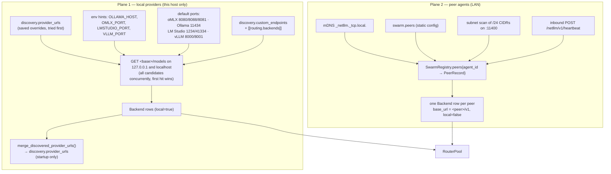
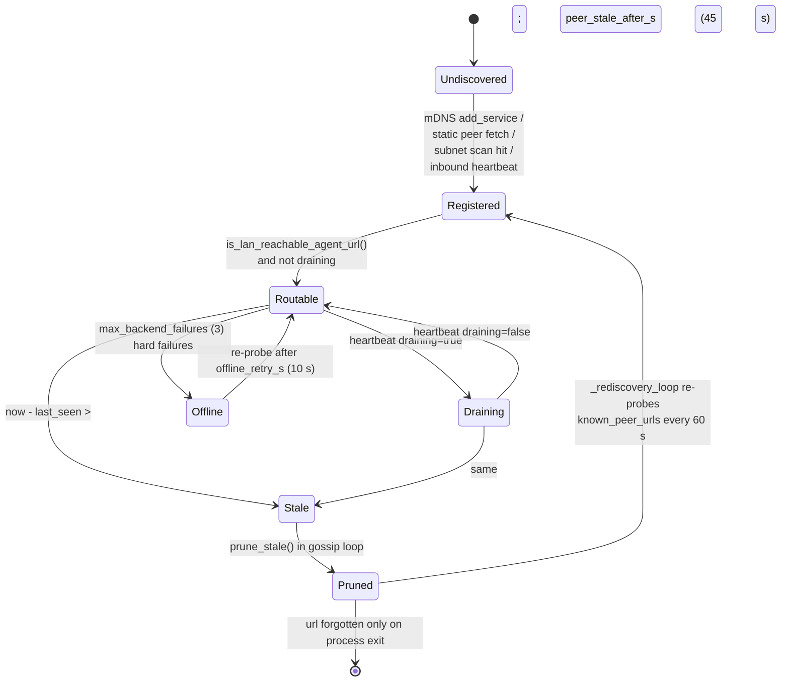
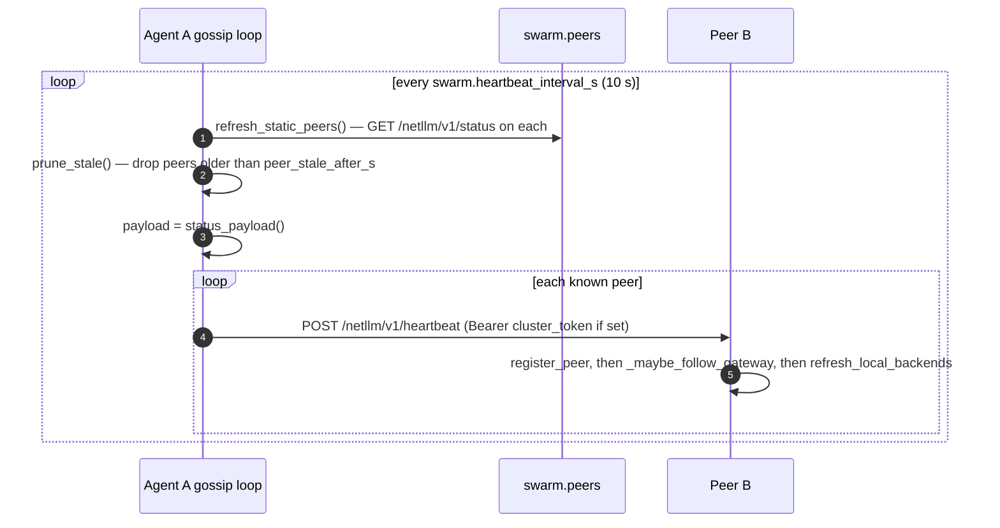
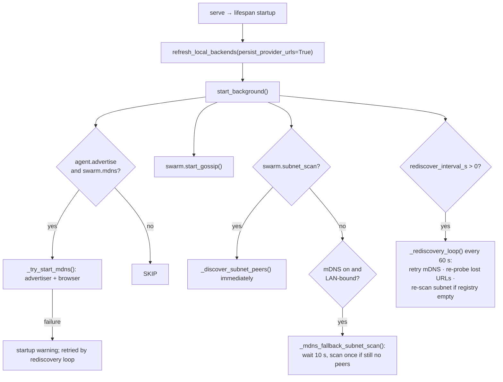

# 04 · Discovery, swarm, and network behaviour

## Two independent discovery planes

### Plane 1 details

- The scan is **TTL-cached at 10 s** (`AgentService._local_scan_ttl_s`) with an
  `asyncio.Lock` stampede guard. Before that cache existed it ran on every proxied request.
- Routine scans are **read-only**: the 1-token inference `diagnose` probe is opt-in
  (`netllm discover`, `netllm test`) because it forces the provider to *load* a chat model,
  which evicts the resident model on memory-constrained hosts.
- `401`/`403` counts as **online (reachable)** for the probe, but a *local* backend that
  probes 401/403 with an empty catalog is excluded from candidacy — otherwise an
  auth-gated LM Studio shows `in_flight = 0`, wins every `least_load` pick, and starves the
  real backends. Cloud injects stay blind candidates because their key arrives per-request.
- Failed probes **keep the last known model catalog** rather than wiping it to `[]`.

### Plane 2 details

- `PeerRecord` carries `agent_id`, `listen_url`, `role`, `hostname`, `backends[]`,
  `routing_strategy`, `version`, `max_concurrency`, `draining`, `last_seen`.
- Only the peer's `local = true` backend rows are consumed
  (`SwarmRegistry._peer_local_rows`). Using a peer's *remote* rows would echo backends
  transitively around the mesh and invite multi-hop chains.
- A peer advertising a **loopback** `listen_url` is skipped with a log line — its URL would
  resolve to our own agent. `netllm peers` surfaces this as the "must serve with
  `--host 0.0.0.0`" hint.
- A **draining** peer is omitted from `peer_agent_backends()` entirely, so it vanishes from
  every strategy's candidate list on the next heartbeat.

## Peer lifecycle state machine

`known_peer_urls` is append-only for the process lifetime — this is what makes recovery from
a sleep/Wi-Fi blip work without a restart, and it is intentional.

## Gossip loop

**Heartbeats are sent sequentially and awaited one at a time.** With N peers and a 5 s
per-peer timeout, one unreachable peer delays every peer behind it in the list, and the
effective heartbeat interval becomes `interval + Σ timeouts`. See F-10.

The heartbeat payload is the **full** `status_payload()` — every backend row with its model
catalog. On a fleet with large catalogs this is a non-trivial payload sent N×N times per
interval; there is no delta encoding or catalog hash (F-21).

## Discovery triggers at startup

The one-shot mDNS-blocked fallback scan is a good design touch: corporate/VLAN networks that
drop multicast still form a mesh, and home installs that never bind the LAN never probe the
subnet.

## Network requirements

| Direction | Port / protocol | Required for |
|-----------|-----------------|--------------|
| Client → agent | TCP 11400 | all APIs and the dashboard |
| Agent → local providers | TCP 8080/8088/8081, 11434, 1234/41334, 8000/8001 (loopback) | local inference |
| Agent ↔ agent | TCP 11400 | heartbeat, forwarded inference, status fetch |
| Agent ↔ LAN | UDP 5353 multicast | mDNS discovery (optional) |
| Agent → subnet | TCP 11400, 64-way concurrency | subnet scan (optional) |
| Agent → internet | TCP 443 | cloud providers, GitHub update check |

The subnet scan enumerates **every host** in the configured /24 and issues a `GET /health`
with a 1.5 s timeout at 64-way concurrency. On a corporate network this looks like a port
scan; it is off by default and only auto-enabled on LAN binds. Worth calling out in
deployment guidance (F-18).

## Security model on the LAN

```mermaid
flowchart LR
    subgraph open["Default: open trusted LAN (netllm init --swarm)"]
        direction TB
        O1["agent.listen = 0.0.0.0:11400"]
        O2["no swarm.cluster_token"]
        O3["POST /v1/* — unauthenticated from anywhere on the LAN"]
        O4["POST /netllm/v1/heartbeat — unauthenticated"]
        O5["admin routes — loopback only (LAN gets 403)"]
    end
    subgraph secured["Secured (netllm init --swarm --secure)"]
        direction TB
        S1["swarm.cluster_token generated"]
        S2["heartbeat requires Bearer token"]
        S3["admin routes accept Bearer token from LAN"]
        S4["/v1/* still open unless<br/>swarm.require_token_for_inference = true"]
    end
    open -->|"netllm swarm-token --create"| secured
```

Three distinct gates, and they are **not** the same gate:

| Gate | Function | Default |
|------|----------|---------|
| `local_admin_client_hosts()` | admin routes: loopback + this host's own addresses | always on |
| `swarm.cluster_token` | heartbeat ingress + remote admin auth | unset |
| `swarm.require_token_for_inference` | `/v1/*` auth for non-local clients | `false` |

Consequence worth stating plainly to the PM: **setting a cluster token does not by itself
protect inference.** A LAN-bound agent with a token still serves `/v1/chat/completions` to any
host on the network until `require_token_for_inference` is also enabled. The CLI warns about
the open case at `serve`, and doctor notes it — but the two-flag design is easy to get wrong
(F-14).

Additionally, `/netllm/v1/status` is unauthenticated and returns every backend URL, model
catalog, hostname, agent id, peer list and version — full fleet reconnaissance for any host
on the LAN (F-13). It has to stay reachable for peer discovery, so the fix is
token-gating it when a token is configured rather than removing it.

## Timing constants

| Constant | Default | Where |
|----------|---------|-------|
| `swarm.heartbeat_interval_s` | 10 s | gossip cadence |
| `swarm.peer_stale_after_s` | 45 s | peer prune age (≈ 4 missed heartbeats) |
| `swarm.rediscover_interval_s` | 60 s | re-probe lost peers, retry mDNS |
| `routing.health_ttl_s` | 30 s | healthy probe freshness |
| `routing.offline_retry_s` | 10 s | offline re-probe (clamped ≤ health_ttl_s) |
| `routing.max_backend_failures` | 3 | consecutive hard failures → offline |
| local scan TTL | 10 s | hardcoded in `AgentService` |
| harness PATH detection TTL | 300 s | hardcoded in `harness_detection` |
| GitHub release cache | 900 s | hardcoded in `update` |
| peer HTTP timeout | 5 s | `fetch_peer`, `send_heartbeat` |
| subnet health probe timeout | 1.5 s | `probe_agent_port` |
| upstream connect / read | 5 s / 120 s | both SDK adapters |

Four of these (local scan TTL, harness TTL, release cache, peer timeout) are hardcoded while
their siblings are configurable — an inconsistency more than a defect (F-20).
