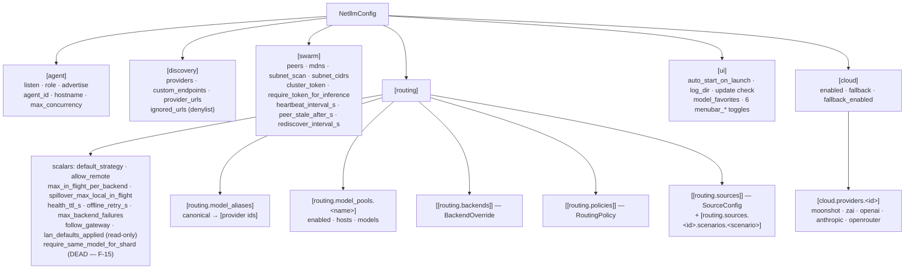
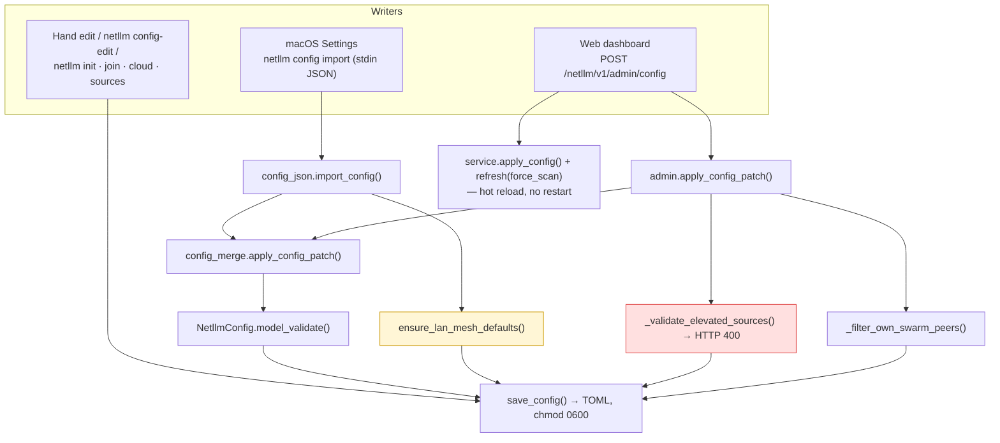
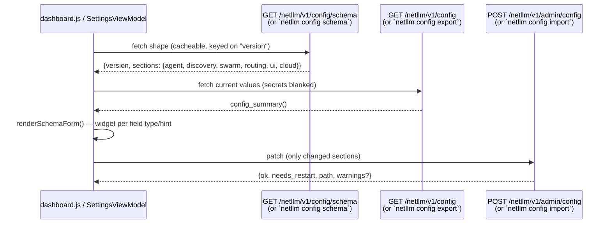
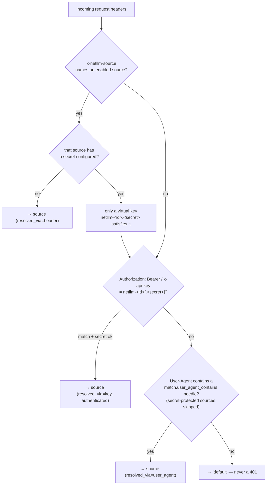
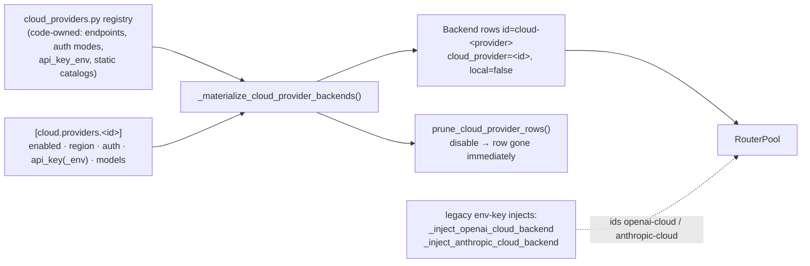

# 05 · Configuration and the control plane

## The config file

Single TOML file, `~/.config/netllm/config.toml` (or `$XDG_CONFIG_HOME/netllm/config.toml`),
written with mode `0600` on POSIX because it holds cluster tokens and API keys.
Six top-level sections, all optional — an absent section validates to its pydantic defaults,
so an empty file is a valid config.



### Field marking conventions

`json_schema_extra` on pydantic fields drives every UI client:

| Marker | Meaning | Examples |
|--------|---------|----------|
| `widget: "secret"` + `write_only: true` | never returned by read APIs; empty on save = keep stored value | `cluster_token`, `api_key`, `sources[].secret` |
| `read_only: true` | server-owned, never form-editable, and dropped from a patch | `agent_id`, `hostname`, `lan_defaults_applied`, `cloud_defaults_applied`, `BackendOverride.cloud_provider` |
| `identity: true` (always with `read_only`) | server-minted stable row id; not rendered, but **must** be echoed back in a patch so the merge can find the row an edit belongs to | `BackendOverride.row_id`, `SourceConfig.row_id` |
| `widget: "select"` + `options_from` | populated from a server registry | `CloudProviderConfig.region` |
| `default_factory: "<name>"` | client-side named builder for "Add row" | `routing.policies` |

## The three config write paths



### Merge semantics (`config_merge.py` — the shared implementation)

The module exists precisely because the CLI and dashboard previously hand-rolled two
divergent merges. Three behaviours, chosen per field:

| # | Behaviour | Applies to | Deletion works? |
|---|-----------|------------|-----------------|
| 1 | Patch value fully replaces | all scalars and lists | yes (omit an entry) |
| 2 | Full-replace dict | `routing.model_pools`, `routing.model_aliases`, `discovery.provider_urls` | yes (omit a key) |
| 3 | Recursive dict-merge, omitted keys preserved | everything else under the 6 sections | no — by design, so unmodeled Swift/JS fields round-trip |
| 3a | Identity-keyed rebuild on top of (3) | `routing.sources` (by `id`), `cloud.providers` (by id) | write-only secrets preserved when omitted |

Special cases layered on top: `swarm.cluster_token` and every `api_key`/`secret` are preserved
when the patch sends empty; `agent.agent_id`/`hostname` are preserved when omitted; unknown
`cloud.providers` keys are dropped by a model validator because the merge layer has no way to
delete them.

**This is well-designed and well-documented — and it has two field-level holes**
(`_merge_backends` drops `max_concurrency`/`cloud_provider`; `_merge_policies` drops `source`).
Both reproduced. See F-01.

### The path asymmetry that matters

| Guard | Dashboard (HTTP) | macOS app / `config import` |
|-------|------------------|------------------------------|
| shared deep-merge | ✅ | ✅ |
| pydantic validation | ✅ | ✅ |
| own-peer URL filtering | ✅ | ❌ |
| elevated-source secret enforcement | ✅ | ❌ **(F-02, reproduced)** |
| LAN mesh defaults | ❌ | ✅ |
| live hot-apply | ✅ | ❌ (needs restart) |

Neither path is a superset of the other. Two of the four asymmetries are defects.

## Schema-driven UI



`config_schema.py` walks the pydantic models and emits widget hints, so a new config field
appears in the generic renderer without touching Swift or JS. `_field_default` deliberately
returns `None` for read-only fields so the document stays byte-identical between calls and
remains cacheable on `version`.

**Scope limits (documented in `config-schema-rewrite-plan.md`, still true):** the macOS app
only renders the `ui` section from schema; `routing`'s non-`model_pools` fields and all of
`cloud` are still hand-typed Swift structs. The triple-mirror (Python ↔ Swift ↔ JS) is reduced,
not eliminated (F-16).

## Admin API

| Endpoint | Method | Gate | Notes |
|----------|--------|------|-------|
| `/netllm/v1/config` | GET | local/token | values, secrets blanked |
| `/netllm/v1/config/schema` | GET | local/token | form shape, version-cacheable |
| `/netllm/v1/doctor` | GET | local/token | subset of CLI doctor; `checks[]` + derived `issues`/`notes` |
| `/netllm/v1/version` | GET | local/token | + resolved SDK versions |
| `/netllm/v1/update/check` | GET | local/token | GitHub latest, 15-min cache |
| `/netllm/v1/logs?tail=N&before=L` | GET | local/token | reverse-block tail, N clamped 1..2000; `before` pages backwards by absolute line number |
| `/netllm/v1/logs?download=1` | GET | local/token | the **unredacted** agent.log as a `text/plain` attachment |
| `/netllm/v1/harnesses` | GET | local/token | registry × configured sources × PATH detection |
| `/netllm/v1/cloud/providers` | GET | local/token | static registry |
| `/netllm/v1/cloud/providers/{id}/models` | GET | local/token | live probe, static fallback |
| `/netllm/v1/admin/config` | POST | local/token | merge + save + hot-apply |
| `/netllm/v1/admin/discover` | POST | local/token | force scan + force probe |
| `/netllm/v1/admin/peers-scan?save=1` | POST | local/token | subnet scan, optional persist |
| `/netllm/v1/admin/drain` | POST | local/token | runtime-only drain toggle |
| `/netllm/v1/client-env` | GET | **none** | env-var snippet (non-secret) |

### Doctor payload shape (UI-6)

`GET /netllm/v1/doctor` and `netllm doctor --json` both return
`{ok, checks[], issues[], notes[]}`. `checks[]` is one row per check that ran —
passing ones included — as `{id, subject, title, ok, severity, detail, fix?,
action}`; `id` is a stable dotted string and is the join key a client uses to
attach a fix button. `issues` and `notes` are *derived* from `checks` and keep
their pre-UI-6 meaning exactly (`netllm_core.doctor_checks`):

```
issues == [{title, fix} for c in checks if not c.ok and c.severity == "error"]
notes  == [c.detail     for c in checks if not c.ok and c.severity == "warn"]
```

`action.kind` is a closed set — `config_patch`, `admin_post`, `navigate`,
`none`. `config_patch`/`admin_post` name an *existing* admin route and carry the
body; there is deliberately no `POST /netllm/v1/admin/doctor/fix {id}`, because
a route whose effect is chosen by server code the caller cannot inspect turns
one admin route into an open-ended one.

`require_admin_access()` allows any client whose source IP is in
`local_admin_client_hosts()` — loopback, `localhost`, `testclient`, plus every address
`getaddrinfo(gethostname())` returns and the interface address discovered by the
`connect(8.8.8.8)` trick. Computed once and cached for the process. On a multi-homed or
oddly-resolving host this set is wider than "this machine" implies (F-17).

## Source identity and per-caller routing



**Attributive by default, authenticated by exception.** An unrecognised caller is labelled
`default` and routed exactly as before the feature existed; it is never rejected. Identity
only becomes a security boundary once a source sets `secret`/`secret_env` — and a source that
grants *elevated* capability (`allow_cloud`, `cloud_providers`, or a `max_concurrency` above
the global cap) **must** be secret-backed once the agent binds beyond loopback.

That last rule is enforced in `admin._validate_elevated_sources` — and bypassed entirely by
the macOS/CLI write path (F-02).

`is_netllm_placeholder_key()` guarantees no `netllm-*` sentinel is ever forwarded upstream as
a real vendor credential; real keys always carry vendor prefixes (`sk-`, `sk-ant-`), so the
check cannot collide.

## Cloud provider control plane



Two parallel mechanisms reach the same pool: the registry-driven `[cloud.providers.*]` path
and the legacy "caller sent a real API key → inject a cloud backend" path. The legacy path is
the source of F-06 (a caller's key becomes the pool's shared credential) and is a prime
consolidation candidate (F-23).

A provider that is `enabled` but has no resolvable key is **not** materialised (it would be
guaranteed to 401); doctor flags that state instead.

## Config-affecting CLI commands

| Command | Writes | Guards applied |
|---------|--------|----------------|
| `init [--swarm --secure]` | full file | `ensure_lan_mesh_defaults` |
| `join URL --token` | listen + peer + token | `ensure_lan_mesh_defaults`, token validation against the target |
| `swarm-token --create/--rotate` | `swarm.cluster_token` | — |
| `gateway` | `agent.role` | — |
| `cloud enable/disable/set-key/fallback/connect` | `[cloud.*]` | provider id validated against registry |
| `sources toggle <id>` | `routing.sources` | registers from `KNOWN_HARNESSES` if new |
| `config import` | any section | merge only — **no elevated-source or own-peer guard** |
| `serve` | `lan_defaults_applied`, `subnet_scan` | one-shot LAN upgrade |
| agent startup | `discovery.provider_urls` | `persist_provider_urls=True` on lifespan |

Nine commands and two UIs can write this file. The merge module made the *mechanics*
consistent; the *guards* are still per-caller (F-02).
