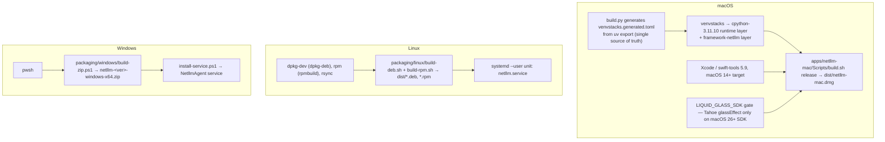
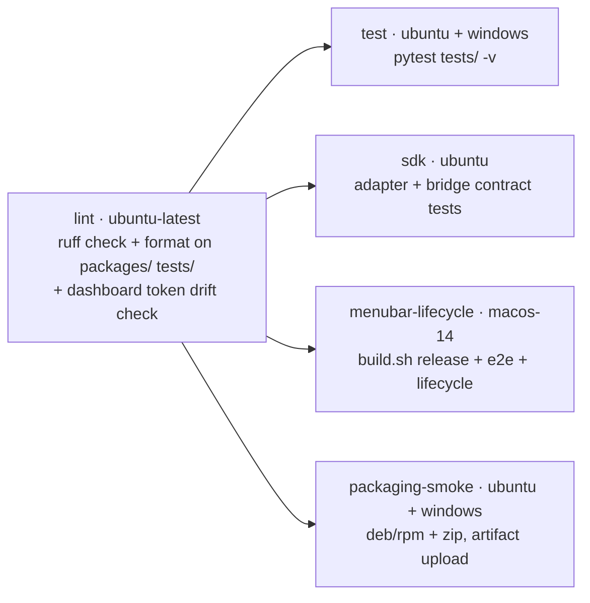

# 06 · Dependencies

Resolved from the committed `uv.lock` on the audited checkout (2026-07-29).
**86 packages** in the default + dev resolution.

## Internal dependency matrix

| Package | Depends on (internal) | Depends on (external) |
|---------|----------------------|----------------------|
| `netllm-core` | — | `httpx`, `pydantic`, `pydantic-settings`, `tomli-w` |
| `netllm-sdk-openai` | — | `openai`, `httpx` |
| `netllm-sdk-anthropic` | — | `anthropic`, `httpx` |
| `netllm-discovery` | `netllm-core` | `httpx`, `zeroconf` |
| `netllm-agent` | `netllm-core`, `netllm-sdk-openai`, `netllm-sdk-anthropic`, `netllm-discovery` | `fastapi`, `uvicorn[standard]`, `prometheus-client`, `httpx` |
| `netllm-cli` | `netllm-core`, `netllm-discovery`, `netllm-agent` | `typer`, `rich`, `httpx` |
| `netllm` (meta) | `netllm-cli` | — |

All six are version-locked in lockstep at `0.4.5.0`; `tests/test_version_sync.py` enforces it.

## Direct runtime dependencies

| Package | Floor pin | Resolved | Role | Blast radius if it breaks |
|---------|-----------|----------|------|---------------------------|
| `httpx` | ≥0.28 | 0.28.1 | every HTTP call, sync + async | total |
| `pydantic` | ≥2.10 | 2.13.4 | config models, validation, schema generation | total |
| `pydantic-settings` | ≥2.6 | 2.14.2 | declared, **no import found in `packages/`** — see note | none |
| `tomli-w` | ≥1.0 | 1.2.0 | `save_config` | config writes |
| `fastapi` | ≥0.115 | 0.136.3 | HTTP surface | agent |
| `uvicorn[standard]` | ≥0.32 | 0.49.0 | ASGI server (pulls uvloop, httptools, watchfiles, websockets, PyYAML, python-dotenv) | agent |
| `prometheus-client` | ≥0.21 | (locked) | `/metrics` | observability only |
| `zeroconf` | ≥0.132 | 0.149.16 | mDNS advertise/browse (pulls `ifaddr`) | LAN auto-discovery only |
| `typer` | ≥0.15 | 0.26.7 | CLI (pulls `click`) | CLI |
| `rich` | ≥13.9 | 15.0.0 | CLI rendering | CLI |
| `openai` | ≥1.60 | **2.41.0** | OpenAI-compatible upstream calls | all OpenAI-format routing |
| `anthropic` | ≥0.45 | **0.106.0** | Anthropic Messages upstream | Anthropic-native backends |

> **Floor-pin drift.** `openai>=1.60` resolves to 2.41.0 — a full major version above the
> declared floor — and `anthropic>=0.45` resolves to 0.106.0. The lock protects the repo,
> but anyone installing `netllm-sdk-openai` standalone (or resolving without the lock) can
> land on an SDK generation the adapter was never tested against. See F-12.

> **`pydantic-settings`** is declared by `netllm-core` but no module under `packages/`
> imports it. Either dead weight or a leftover from an earlier config loader. See F-09.

## Undeclared and optional dependencies

| Package | Where used | Declared? | Effect |
|---------|-----------|-----------|--------|
| `psutil` | `netllm_agent/telemetry.py:248` — `_host_block()` | **No** — not in any `pyproject.toml`, not in `uv.lock` | The telemetry `host` block (CPU %, memory) is `None` on every shipped install. Documented in `packages/netllm-agent/AGENTS.md` as "optional psutil host block on Linux when installed", but nothing installs it. See F-08. |
| `zeroconf` | mDNS | Yes (core dep of `netllm-discovery`) | The `mdns = []` optional-extra in `pyproject.toml` and two package files is a no-op backwards-compat alias. See F-15. |

## Dev / tooling dependencies

| Package | Resolved | Role |
|---------|----------|------|
| `pytest` | 9.0.3 | test runner (`asyncio_mode = auto`) |
| `pytest-asyncio` | ≥0.24 | async tests |
| `ruff` | 0.15.16 | lint + format (E, F, I, UP; line 88) |
| `basedpyright` | 1.39.6 | type checking, `standard` mode — **not run by `scripts/ci.sh` or any CI job** (F-27) |
| `httpx` | 0.28.1 | test client |
| `venvstacks` | 0.7.0 | macOS Python layer builder |
| `pre-commit` | ≥4.0 | local hooks (`.pre-commit-config.yaml`) |

## Platform and build dependencies

**Only macOS ships a GUI.** Linux and Windows use the bundled web dashboard at
`http://127.0.0.1:11400/ui/`.

**arm64-only macOS packaging.** `packaging/venvstacks.toml` declares
`platforms = ["macosx_arm64"]` and `environments = ["sys_platform == 'darwin' and
platform_machine == 'arm64'"]`. There is no Intel-Mac artifact path (F-18).

## CI dependency

Every job needs `lint`. `astral-sh/setup-uv@v5` with cache, `uv sync --frozen` — the lock is
authoritative in CI.

**Gaps in the gate:** `basedpyright` is configured but never invoked; `ruff` covers only
`packages/` and `tests/`, leaving `scripts/`, `packaging/build.py`, and `src/` unlinted even
though `pyproject.toml`'s `[tool.ruff]` is repo-wide; there is no Swift lint, no JS lint, and
no macOS packaging smoke on PRs (only the full `build.sh release`). See F-27.

## Release-time external dependencies

| Dependency | Used by | Failure mode |
|------------|---------|--------------|
| `api.github.com/repos/matthewdcage/llm-swarm-router/releases/latest` | `netllm_core.update`, macOS `UpdateController` | update check returns `error`, agent unaffected; 15-min cache, unauthenticated (60 req/h/IP rate limit) |
| GitHub release asset hosting | DMG / deb / rpm / zip download | update install fails |
| `SHA256SUMS` or `<asset>.sha256` sidecars | integrity verification | verification skipped if absent — the Swift path only verifies **when a sidecar exists** |
| Apple notarization service | signed DMG | currently **not enabled**; DMGs are ad-hoc signed and Gatekeeper blocks them on macOS 26+ |
| Homebrew tap (`Formula/`) | `brew install netllm` | — |

## Upstream inference servers (runtime, not build)

| Provider | Default ports probed | API | Notes |
|----------|---------------------|-----|-------|
| oMLX (Apple Silicon) | 8080, 8088, 8081 | OpenAI-compatible + `/admin` API | only provider with deep telemetry integration; default key `omlx-local` |
| Ollama | 11434 | OpenAI-compatible | honours `OLLAMA_HOST` |
| LM Studio | 1234, 41334 | OpenAI-compatible | may require an API key |
| vLLM | 8000, 8001 | OpenAI-compatible | |
| custom | `discovery.custom_endpoints`, `[[routing.backends]]` | OpenAI or Anthropic | |

Per-provider env overrides: `OMLX_PORT`, `OLLAMA_PORT`/`OLLAMA_HOST`, `LMSTUDIO_PORT`,
`VLLM_PORT`; keys via `OMLX_API_KEY`, `OLLAMA_API_KEY`, `LMSTUDIO_API_KEY`, `VLLM_API_KEY`.

## Cloud provider registry (code-owned reference data)

| id | Auth modes | Default format | Live `/models`? | Caveat recorded in-code |
|----|-----------|----------------|-----------------|------------------------|
| `moonshot` | api_key | openai | yes | PAYG keys only |
| `zai` | api_key | openai | **no** (static catalog) | Coding Plan keys are contractually restricted to an approved-tools list — using them from a generic router may be outside that policy |
| `openai` | api_key | openai | yes | no public OAuth for third-party tools |
| `anthropic` | api_key, plan_token | anthropic | yes | `plan_token` (from `claude setup-token`) is documented for Claude Code CI only — unofficial for third-party routers |
| `openrouter` | api_key, oauth_pkce | openai | yes | the only sanctioned third-party OAuth |

The registry is honest about the two policy-sensitive modes, and both are opt-in.
`static_models` entries (e.g. `kimi-k3`, `glm-5.2`, `gpt-5.6`, `claude-opus-4-7`) are
hand-maintained code constants and will drift — the live probe is preferred wherever the
provider offers one (F-21).

## Supply-chain surface summary

| Vector | Exposure | Mitigation in place |
|--------|----------|--------------------|
| Python deps | 86 packages, `uv.lock` committed, `--frozen` in CI | good |
| Vendor SDK majors | floors far below resolved versions | lock only — F-12 |
| `zeroconf` | listens on UDP 5353, parses untrusted multicast | wrapped in try/except; failure degrades to static peers |
| GitHub update JSON | parsed into `ReleaseAsset` | download URLs come from the API response and are not host-validated |
| DMG/zip integrity | SHA256 sidecar | verified **only when present**; absent sidecar silently skips verification |
| Local provider probes | `verify=False` on the shared scan client | applies to *all* scanned URLs including remote HTTPS overrides — F-05 |
