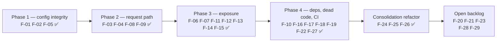

# 07 · Findings register

29 findings from a source-level audit of `main` @ `a3ec16a` (release 0.4.5.0), 2026-07-29.
Four were reproduced with executable scripts; the rest carry `file:line` evidence.

**24 resolved, 1 partial, 4 open** as of the F-24/F-25/F-26 consolidation branch
(`a4c8893`…HEAD). Each fixed finding carries a `RESOLVED (<commit>)` note under its
heading; IDs are never renumbered, so commit messages and the traceability matrix keep
pointing at the same thing. F-24, F-25 and F-26 — the two large refactors this register
originally scoped out — closed together; the residue they did not cover is tracked as
F-54 (dashboard.js split) and F-55 (two re-export module shims) in
[09](09-follow-up-audit-2026-07-31.md), never by re-opening a closed ID.

**Baseline health is good.** At audit time `uv run pytest -q` → **584 passed**;
after remediation → **642 passed**; after the F-24/F-25/F-26 consolidation →
**1,087 passed, 4 skipped** (356 of them the contract suite, which did not exist
before). Lint is clean.
The SDK isolation boundary holds. The routing hardening work described in
`docs/routing-hardening-plan.md` is genuinely implemented, and the failover, capacity-error
classification, and mesh loop guards are better than typical for a project this size.
Nothing below contradicts that; these are the remaining edges.

## Severity summary

| Severity | Count | Fixed | Theme |
|----------|-------|-------|-------|
| **S1** — production-affecting correctness or security | 4 | **4** | silent config data loss, a bypassed security guard, event-loop blocking, credential reuse across callers |
| **S2** — real user-visible defect or meaningful risk | 12 | **12** | restart-required config, TLS off, billable probes, races, IPv6 crash, LAN exposure, log growth |
| **S3** — maintenance, clarity, latent risk | 13 | **8 + 1 partial** | dead code, duplicated logic, CI gate gaps, packaging limits |

**Still open (all S3):** F-20 (admin allowlist scoping), F-21 (config schema
mirror), F-23 (N×N heartbeat catalogs), F-28 (packaging limits), F-29 (oMLX in
discovery). F-24/F-25/F-26 were deliberately excluded from the original
remediation and were closed later by the consolidation refactor.

## Recommended order of work



Delivered as four independent commits on `docs/architecture-audit`:
`6a5d190` (config integrity) · `3b6ec71` (request path) · `15ac9c7` (exposure) ·
`bb3eae0` (deps, dead code, CI).

---

# S1 — production-affecting

## F-01 · Saving config silently drops three fields

> **RESOLVED (`6a5d190`) — both merges rebuild from the prior row keyed on `model_fields`; two tests fail if a new field is added without teaching the merge about it.**

**Severity** S1 · **Area** configuration integrity · **Reproduced**

`config_merge._merge_backends()` rebuilds each `[[routing.backends]]` entry from an explicit
field list that omits `max_concurrency` and `cloud_provider`.
`config_merge._merge_policies()` rebuilds each `[[routing.policies]]` entry from a list that
omits `source`.

- `packages/netllm-core/src/netllm_core/config_merge.py:60` (`_merge_backends`)
- `packages/netllm-core/src/netllm_core/config_merge.py:86` (`_merge_policies`)

Both write paths — the web dashboard and the macOS Settings app — go through this module,
so **any** save that touches `routing.backends` or `routing.policies` silently resets those
fields, even if the user never edited them.

**Reproduction (run and confirmed):**

```python
cfg.routing.backends = [BackendOverride(base_url="http://x:1/v1", provider="vllm", max_concurrency=4)]
cfg.routing.policies = [RoutingPolicy(name="p1", source="buzz", model_prefix="glm", allow_cloud=True)]
out = apply_config_patch(cfg, {"routing": {"backends": [...], "policies": [...]}})
# backend max_concurrency after save: 0   (was 4)
# policy.source after save: ''            (was 'buzz')
```

**Why it matters beyond data loss:** `RoutingPolicy.source` scopes a policy to one caller.
Dropping it converts a policy written as *"the `buzz` harness may reach cloud"* into
*"**everyone** may reach cloud"* — a silent privilege widening triggered by an unrelated save.

**Fix.** Add the missing keys to both field lists, and add a regression test that asserts
`set(merged.keys()) == set(Model.model_fields)` for `BackendOverride` and `RoutingPolicy`, so
the next field addition cannot reintroduce the class of bug. `_merge_sources` and
`_merge_cloud_providers` already use an explicit tuple + `prior.model_dump()` base — copy that
shape rather than the hand-built dict.

---

## F-02 · Elevated-source secret enforcement is bypassed by the macOS app and CLI

> **RESOLVED (`6a5d190`) — guards moved to `netllm_core.config_guards`; both writers call them. `ConfigGuardError` keeps FastAPI out of core.**

**Severity** S1 · **Area** security · **Reproduced**

`admin._validate_elevated_sources()` refuses to save a `routing.sources` entry that grants
elevated capability (`allow_cloud`, `cloud_providers`, or `max_concurrency` above the global
cap) without a `secret`/`secret_env` when `agent.listen` is LAN-reachable.

- Guard: `packages/netllm-agent/src/netllm_agent/admin.py:334`
- Called only from: `packages/netllm-agent/src/netllm_agent/admin.py:324` (HTTP path)
- Bypassing path: `packages/netllm-cli/src/netllm_cli/config_json.py:19` (`import_config`)

The macOS Settings **Save** button and `netllm config import` call
`config_merge.apply_config_patch()` directly and never run the guard.

**Reproduction (run and confirmed)** — LAN-bound config, save via the CLI path:

```
CLI path saved elevated source with no secret: evil allow_cloud=True secret=''
is_elevated: True
```

**Impact.** On a LAN-bound agent, any host that can send `x-netllm-source: evil` (or the bare
virtual key `netllm-evil`) then inherits that source's cloud access and concurrency
allowance. `source_identity.resolve_source()` is attributive by design: with no secret
configured, *any* matching signal wins the identity. The whole point of the guard is to make
sure identity spoofing can only ever win cheap local routing.

The same path also skips `_filter_own_swarm_peers()`, so the macOS app can persist a
self-referential peer URL that the dashboard would have rejected.

**Fix.** Move both post-merge guards out of `admin.py` into `config_merge` (or a new
`config_guards` module) and call them from every writer. Raise a domain exception that
`admin.py` maps to HTTP 400 and the CLI maps to a non-zero exit with a readable message —
`config_merge` must not import `fastapi.HTTPException`.

---

## F-03 · Synchronous health probes run on the event loop on every request

> **RESOLVED (`3b6ec71`) — metrics read the cache and never probe; the doctor route is offloaded.**

**Severity** S1 · **Area** performance / concurrency

*Rewritten 2026-07-29: `26c45b7` (mesh fix #36) landed mid-audit and changed this
finding's shape — it narrowed the original problem and introduced a second instance
of it. The description below is against `26c45b7`, not the `a3ec16a` baseline.*

`AgentService._update_health_metrics()` iterated every backend calling
`RouterPool.is_healthy()`, which issues **blocking** `httpx.Client` calls whenever a
cache entry is stale. It runs from `refresh_local_backends()` — awaited by every proxy
entry point — and again in the `finally` of every attempt. With a 5 s probe timeout, one
unresponsive backend stalled the entire ASGI loop: every concurrent request, the
dashboard, the gossip loop, and `/health`.

`26c45b7` made peer rows use the cheap cached verdict (`cached_peer_online`), which
removed peer probes from this path. **Local and cloud rows still probed**, and the
`cloud-anthropic` row was the worst case — a real network round-trip to Anthropic
(compounded by F-07, which made that probe a billable Messages call).

The same commit also added a *new* instance: `admin.doctor_payload` gained
`refresh_peer_health(force=True)` plus a force-probe of every local backend, and
`app.netllm_doctor` called it directly from an `async def`. `netllm_status` had always
wrapped its probe pass in `asyncio.to_thread`; the doctor route did not.

Second-order effect, now removed: because `_update_health_metrics` refreshed every cache
entry as a side effect, `pool.any_health_stale()` was almost always `False` by the time
selection ran, so `_offload_if_probing()` (`service.py:920`) — the guard that exists
precisely to keep probes off the loop — almost never fired. The guard had been
pre-empted by the metrics pass.

**Fix applied.** `_update_health_metrics` now reports `pool.cached_online(backend)` for
every row and never probes; `netllm_doctor` wraps `doctor_payload` in
`asyncio.to_thread`. Probing happens only in the offloaded selection path and on the
explicit refresh routes (`status?probe=1`, `?probe_peers=1`, doctor). `_offload_if_probing`
is load-bearing again.

**Verified.** With an unprobed black-hole backend (`203.0.113.7`, TEST-NET-3) in the
pool, `/health` answers in **0.8 ms** worst case and `/netllm/v1/backends` in 0.3 ms,
where the 5 s probe timeout previously applied. A regression test asserts
`_update_health_metrics` calls none of the three probe functions.

---

## F-04 · A caller's cloud API key becomes a shared pool credential

> **RESOLVED (`3b6ec71`) — legacy cloud rows are request-scoped via `extra_candidates` and never pooled; their upstream clients bypass the shared cache.**

**Severity** S1 · **Area** security / billing

`_inject_openai_cloud_backend()` and `_inject_anthropic_cloud_backend()` take the API key
from the **incoming request's** `Authorization` / `x-api-key` header and merge a cloud
`Backend` row carrying that key into the long-lived pool.

- `packages/netllm-agent/src/netllm_agent/service.py:1318` (`_inject_anthropic_cloud_backend`)
- `packages/netllm-agent/src/netllm_agent/service.py:1341` (`_inject_openai_cloud_backend`)
- caller key extraction: `service.py:1291-1308`

Both are idempotent by *existence*, not by key:

```python
if any(b.api_format == "anthropic" for b in self.pool.backends):
    return                       # first key in wins, and stays
```

So the first caller to present a real vendor key seeds a routable backend. Every subsequent
request from **any other client on the LAN** can be routed to `openai-cloud` /
`anthropic-cloud` and billed to that first caller's account. The row survives until the
provider is disabled or the process restarts; `prune_cloud_provider_rows` explicitly keeps
the legacy ids alive (`service.py:1463`).

The Anthropic variant is broader still: the guard is "any anthropic-format backend exists",
so a locally-configured Anthropic-format backend suppresses the inject entirely, and vice
versa.

**Impact scales with the deployment.** On a single-user loopback install this is harmless.
On the LAN-swarm topology the product actively promotes, it is cross-tenant credential reuse.

**Fix.** Either (a) scope caller-supplied keys to the single request — build a throwaway
`OpenAIUpstream`/`AnthropicUpstream` for that request instead of a pool row, or (b) retire
the legacy inject path entirely in favour of the registry-driven
`_materialize_cloud_provider_backends()` (which uses *configured* keys, not caller keys) and
document the migration. Option (b) also resolves half of F-25.

---

# S2 — real defects and meaningful risk

## F-05 · Changed `max_concurrency` never reaches an existing pool row

> **RESOLVED (`6a5d190`) — `merge_backends` copies `max_concurrency`/`cloud_provider` onto the live row.**

**Severity** S2 · **Area** configuration / routing

`RouterPool.merge_backends()` updates existing local rows **in place** (correctly — in-flight
requests hold the object reference), but the field list it copies omits `max_concurrency` and
`cloud_provider`:

- `packages/netllm-core/src/netllm_core/pool.py:126-134`

So editing a backend's concurrency cap has no effect until the process restarts, even though
`apply_config()` invalidates the scan cache and the dashboard reports a successful hot-apply.
Combined with **F-01** (the value is dropped on save anyway), `BackendOverride.max_concurrency`
is currently unusable end to end.

**Fix.** Add both fields to the in-place update block; fix F-01 in the same change; add a test
that sets a cap through `apply_config` and asserts the live pool row reflects it.

---

## F-06 · TLS verification is disabled for every discovery probe

> **RESOLVED (`15ac9c7`) — loopback and remote probe targets get separate clients; only loopback waives verification.**

**Severity** S2 · **Area** security

```python
def loopback_async_client(**kwargs) -> httpx.AsyncClient:
    return httpx.AsyncClient(verify=False, **kwargs)
```

- `packages/netllm-discovery/src/netllm_discovery/local.py:30`

The docstring justifies it as "bundled macOS Python may lack CA bundle" for *localhost*
probes — a reasonable motivation. But the same client is used in `scan_local_providers()` for
`discovery.custom_endpoints` and every `[[routing.backends]]` override
(`local.py:254-274`), which may be arbitrary remote `https://` URLs. Health responses feed the
model catalog that drives routing, so a MITM on a remote custom endpoint can influence which
backend is selected.

**Fix.** Split the clients: `verify=False` only when the resolved host is loopback; a normal
verifying client otherwise. `is_loopback_url()` already exists in `netllm_discovery.lan`.

---

## F-07 · Anthropic health probes are billable API calls with a hardcoded model

> **RESOLVED (`15ac9c7`) — free `GET /v1/models` first; the Messages fallback only for catalog-less providers, using a model that backend serves.**

**Severity** S2 · **Area** cost / correctness

`probe_anthropic_compat_sync()` and its async twin POST a real Messages request
(`max_tokens: 1`, `"hi"`) against a hardcoded `claude-3-5-haiku-20241022`:

- `packages/netllm-core/src/netllm_core/health.py:188` and `:212`

This runs through `RouterPool.is_healthy()` for any `api_format == "anthropic"` backend —
including the materialised `cloud-anthropic` row — every `routing.health_ttl_s` (30 s default),
and via F-03 on the request path. That is a paid API call roughly every 30 seconds for the
lifetime of the agent, plus a hard dependency on one model id remaining available on every
Anthropic-compatible provider (Moonshot's and Z.ai's Anthropic endpoints will not serve it).

**Fix.** Probe `GET /v1/models` with `x-api-key` first (Anthropic and OpenRouter both support
it — `cloud_provider_models_probe` already does exactly this at `service.py:1523`) and fall
back to the message probe only when the provider has no catalog endpoint. If the message
probe must stay, take the model from `backend.health.models` or the provider spec's
`static_models` rather than a constant.

---

## F-08 · Per-source concurrency cap is check-then-act across an await

> **RESOLVED (`3b6ec71`) — `_source_admit` checks and reserves atomically before the first await; the reservation is held for the whole request.**

**Severity** S2 · **Area** concurrency

```
_check_source_capacity(source_id, source_cfg)   # reads _source_in_flight
...
await self.refresh_local_backends()             # ← await point
...
self._source_acquire(resolved_source.id)        # increments
```

- check: `packages/netllm-agent/src/netllm_agent/service.py:766`
- call sites: `service.py:954`, `1064`, `1207`, `1656`, `1759`
- acquire: `service.py:778`, called inside the attempt loop

Because the check happens once before an `await`, N concurrent requests for the same source
can all observe `in_flight < cap` and all proceed. The cap is advisory under exactly the load
it exists to bound.

**Fix.** Check-and-increment atomically before the first await (a small helper that raises
`SourceCapacityExceeded` and otherwise increments), and release once per request rather than
once per attempt. Note the current code also acquires/releases per *attempt*, so a retrying
request briefly counts as one, then zero, then one again.

---

## F-09 · All-time telemetry is written to disk synchronously on every request

> **RESOLVED (`3b6ec71`) — debounced to 10 s, flushed in `close()`.**

**Severity** S2 · **Area** performance

`TelemetryService.record_usage()` calls `_save_alltime()` on every call, which does
`mkdir` + `json.dumps` + `write_text` to `~/.config/netllm/stats.json` — synchronously, on the
event loop, once per completed request.

- `packages/netllm-agent/src/netllm_agent/telemetry.py:156` (call) and `:120` (write)

**Fix.** Debounce: persist at most every N seconds or every N requests, plus a final flush in
`TelemetryService.close()` (which is already wired into the FastAPI lifespan shutdown).

---

## F-10 · `psutil` is used but never declared — host telemetry is always empty

> **RESOLVED (`bb3eae0`) — `psutil` is a declared dependency of `netllm-agent`.**

**Severity** S2 · **Area** dependency / feature completeness

`TelemetryService._host_block()` imports `psutil` inside a `try/except ImportError` and
returns `None` on failure.

- `packages/netllm-agent/src/netllm_agent/telemetry.py:248`

`psutil` appears in **no** `pyproject.toml` and **not** in `uv.lock`. `packages/netllm-agent/AGENTS.md`
documents it as "optional psutil host block on Linux when installed" — but nothing in any
install channel installs it, so the `host` block of `GET /netllm/v1/telemetry` is `null` on
every shipped build. The macOS app is unaffected (it has its own `HostSampler.swift`); the
**web dashboard on Linux and Windows** is the surface that silently loses the feature.

**Fix.** Either declare `psutil` as a real dependency of `netllm-agent` (it is small,
pure-ish, and widely deployed) or as a documented `netllm-agent[host-metrics]` extra that the
Linux/Windows packages install — then say so in the docs. Leaving it undeclared means the
feature ships dead.

---

## F-11 · A bracketed IPv6 `agent.listen` passes validation, then crashes `serve`

> **RESOLVED (`15ac9c7`) — `split_listen`/`format_listen` in `netllm_core.models`; all six call sites use them.**

**Severity** S2 · **Area** correctness · **Reproduced**

`AgentConfig._validate_listen()` explicitly accepts bracketed IPv6 (`[::]:11400`):

- `packages/netllm-core/src/netllm_core/models.py:340-361`

But `serve` parses it with `partition(":")`:

```python
host_part, _, port_part = cfg.agent.listen.partition(":")   # main.py:1146
uvicorn.run(fastapi_app, host=host_part or "127.0.0.1", port=int(port_part or 11400))
```

For `"[::]:11400"` that yields `host_part = "["`, `port_part = ":]:11400"`, and
`int(":]:11400")` raises `ValueError` — the agent fails to start with a raw traceback.

**Reproduction (run and confirmed):**

```
serve partition -> '[' ':]:11400'
PORT PARSE FAILS: invalid literal for int() with base 10: ':]:11400'
```

Two more sites share the flaw: the `--host`/`--port` override at `main.py:974-975`
(`listen.split(":")[0]`), and `lan.agent_url_from_listen()` (`lan.py:86`), which happens to
produce a correct-looking string by accident while never extracting the port.

**Fix.** There is already a correct helper — `netllm_cli.main._listen_port_of()`
(`main.py:150`), which is IPv6-aware. Promote it (and a matching `_listen_host_of`) into
`netllm_core.models` next to the validator, and use it at all three sites. Add a test case for
`[::]:11400` and `[::1]:11400`.

---

## F-12 · Heartbeats are sent sequentially and awaited one at a time

> **RESOLVED (`15ac9c7`) — bounded `asyncio.gather` fan-out that returns exceptions instead of aborting the cycle.**

**Severity** S2 · **Area** scalability

```python
for peer in list(self.peers.values()):
    await self.send_heartbeat(payload, peer.listen_url)     # 5 s timeout each
```

- `packages/netllm-discovery/src/netllm_discovery/swarm.py:197-200`
- `refresh_static_peers()` at `swarm.py:179` has the same shape

With a 10 s interval and a 5 s per-peer timeout, three unreachable peers push the effective
heartbeat cycle past 15 s — beyond the 45 s stale window after four such cycles, so healthy
peers can be pruned because a *different* peer is down.

**Fix.** `asyncio.gather` the heartbeat fan-out (and the static-peer refresh) with a bounded
semaphore, mirroring the pattern `subnet_scan_agents` already uses (`lan.py:214`).

---

## F-13 · `/netllm/v1/status` and `/netllm/v1/telemetry` are unauthenticated

> **RESOLVED (`15ac9c7`) — `require_read_access` gates status/peers/backends/telemetry whenever a cluster token exists. No token = unchanged.**

**Severity** S2 · **Area** security / information disclosure

Both routes are registered with no gate:

- `packages/netllm-agent/src/netllm_agent/app.py:137` (`netllm_status`)
- `app.py:163` (`netllm_telemetry`)
- also ungated: `/netllm/v1/peers` (`:184`), `/netllm/v1/backends` (`:188`),
  `/netllm/v1/client-env` (`:273`)

On a LAN-bound agent, any host on the network gets: every backend base URL, the full model
catalog per backend, hostnames, agent ids, the peer list with versions and strategies,
per-backend routed counts and in-flight load, token totals, and whether a cluster token is
set. That is complete fleet reconnaissance, and `routed_requests`/token counters leak usage
patterns.

`status` genuinely must stay reachable — `SwarmRegistry.fetch_peer()` and the subnet scan both
GET it, though **both already send the cluster token** when one is configured
(`swarm.py:147`, `lan.py:119`).

**Fix.** Gate `status`, `peers`, `backends`, and `telemetry` with the same optional-token check
the heartbeat uses: when `swarm.cluster_token` is set, require it from non-local clients.
Peer-to-peer discovery keeps working unchanged because peers already authenticate. Keep them
open when no token is configured, preserving today's zero-config behaviour.

---

## F-14 · A cluster token does not protect inference

> **RESOLVED (`15ac9c7`) — `init --swarm --secure` sets `require_token_for_inference`; existing configs get a doctor issue rather than a silent rewrite.**

**Severity** S2 · **Area** security UX

Three independent gates exist and are easy to conflate:

| | gates | default |
|---|---|---|
| `swarm.cluster_token` | heartbeat ingress + *remote admin* auth | unset |
| `swarm.require_token_for_inference` | `/v1/*` for non-local clients | **false** |
| `local_admin_client_hosts()` | admin routes | always |

- `packages/netllm-agent/src/netllm_agent/app.py:62-85` (`require_inference_access`)

So `netllm init --swarm --secure` — which a user reasonably reads as "the secure option" —
generates a token, secures gossip and remote admin, and still leaves
`POST /v1/chat/completions` open to the entire LAN. Nothing in the `--secure` flow sets
`require_token_for_inference`.

`doctor` notes the open case and `serve` warns, but the warning fires on the *no-token* path,
not on the token-but-open-inference path.

**Fix (product decision, not just code).** Make `--secure` set
`require_token_for_inference = true`, and have `netllm join` configure joining clients
accordingly (peers already forward the token via `_upstream_api_key`). At minimum, add a
doctor issue for "cluster token set but inference is open" so the state is visible.

---

## F-15 · `agent.log` grows without bound

> **RESOLVED (`15ac9c7`) — `RotatingFileHandler`, 10 MB × 3.**

**Severity** S2 · **Area** operations

`serve` attaches a plain `logging.FileHandler` to the uvicorn loggers:

- `packages/netllm-cli/src/netllm_cli/main.py:1138`

No `RotatingFileHandler`, no size cap, no retention — and the file is the one
`GET /netllm/v1/logs` tails and the one every troubleshooting doc points users at. A
long-running agent with per-request warnings (a flapping backend, the `shardless_fallbacks`
warning path) will grow it indefinitely. macOS app installs also write `app.log` under
`~/Library/Application Support/netllm/logs/`.

**Fix.** `RotatingFileHandler(maxBytes=10*1024*1024, backupCount=3)`. One line, and
`tail_log_file()` already handles arbitrary file sizes correctly via reverse block reads.

---

## F-16 · Vendor SDK floor pins sit a major version below what ships

> **RESOLVED (`bb3eae0`) — `openai>=2.0,<3`, `anthropic>=0.100,<1`; a test asserts both bounds exist.**

**Severity** S2 · **Area** dependency risk

| Package | Declared floor | Resolved in `uv.lock` |
|---------|---------------|----------------------|
| `openai` | `>=1.60` | **2.41.0** |
| `anthropic` | `>=0.45` | **0.106.0** |

- `packages/netllm-sdk-openai/pyproject.toml`, `packages/netllm-sdk-anthropic/pyproject.toml`
- documented as current in `docs/sdk-versions.md`, "last validated 2026-06-08"

The lock protects this repo and CI. It does **not** protect anyone who installs
`netllm-sdk-openai` from an index, or a downstream resolver that re-resolves — those can land
on `openai==1.x`, which the adapter has not been tested against since the 2.x migration.

**Fix.** Raise the floors to the tested major (`openai>=2.0`, `anthropic>=0.100`) and add an
upper bound on the next major (`<3`, `<1`) so a silent major bump can't reach an untested
adapter. The `sdk-canary.yml` workflow already exists to catch upstream drift deliberately;
floors should encode what is *supported*, not what once worked.

---

# S3 — maintenance, clarity, latent risk

## F-17 · `require_same_model_for_shard` is a dead field still shown in two UIs

> **RESOLVED (`bb3eae0`) — removed from `config_summary`, `dashboard.js` and both Swift surfaces. The pydantic field stays one release so existing configs load.**

`RoutingConfig.require_same_model_for_shard` is documented in-code as *"Deprecated: only
consumed by the removed batch planner"* (`models.py:272-273`) — yet it is still exported by
`config_summary()` (`admin.py:277`), rendered in `dashboard.js`, modelled in
`NetllmConfigDocument.swift`, and shown in `SettingsWindowView.swift`. A user can toggle a
control that does nothing.

`docs/routing-hardening-plan.md` was **internally contradictory**, not simply wrong: the Phase 1
"Implemented" bullet asserted the field "is now actually wired into `plan_batch_shard`", while
the Phase 5 "Dead code removed" entry correctly recorded that `plan_batch_shard` was deleted and
the field "is therefore a no-op again". The Phase 1 bullet was never struck through when Phase 5
landed. `config.example.toml:53-54` and `packages/netllm-core/AGENTS.md` both already said
deprecated.

**Status.** The plan doc was corrected on 2026-07-29 (Phase 1 bullet struck through, pointing at
the Phase 5 removal). The code-side removal is still open.

**Fix (remaining).** Drop the field from `config_summary`, `dashboard.js`, and both Swift
surfaces — keep it accepted-and-ignored in the pydantic model for one release so existing
configs still load, then remove.

---

## F-18 · Orphaned code inventory

> **RESOLVED (`bb3eae0`) — dead symbols deleted; `BatchRequestLedger.completed` is now read by `reassign_failed`.**

Verified with repo-wide greps that include the test suites:

| Symbol | Location | Status |
|--------|----------|--------|
| `OpenAIUpstream.list_models()` | `netllm_sdk_openai/client.py:50` | zero callers anywhere, including tests |
| `OpenAIUpstream.chat_completion_sync()` | `client.py:82` | zero callers |
| `OpenAIUpstream.embeddings_sync()` | `client.py:96` | zero callers |
| `BatchRequestLedger.completed` / `mark_done()` | `netllm_agent/shard.py:34,77` | written on every shard success, **never read** |
| `update.cleanup_cache()` | `netllm_core/update.py:250` | no production caller (the Swift `UpdateController` does its own cache management) |
| `update.verify_sha256()` | `update.py:245` | tests only (`UpdateController.verifySHA256` is the shipping implementation) |
| `known_harnesses.CUSTOM_SENTINEL_ID` | `known_harnesses.py:16` | defined and documented, referenced nowhere |
| `mdns = []` optional extra | `pyproject.toml:16`, `netllm-agent/pyproject.toml`, `netllm-discovery/pyproject.toml` | self-described no-op backwards-compat alias, ×3 |
| `pydantic-settings` | declared by `netllm-core` | no `pydantic_settings` import in any first-party module — see F-19 |
| `netllm_core/config.py` | 41 lines | pure re-export of `models.py`; both are imported across the codebase, so there are two names for one module |

The `completed` set is the interesting one: `BatchRequestLedger` tracks which shards finished
but nothing consumes it, so a retried batch cannot distinguish "not yet assigned" from
"already succeeded". Either wire it into `reassign_failed`/`assign` or delete it.

**Fix.** Delete the unreferenced symbols; keep `verify_sha256` only if the Python update path
is intended to grow an installer (say so in a comment); collapse `config.py` into `models.py`
with a deprecation shim.

---

## F-19 · `pydantic-settings` is declared but never imported

> **RESOLVED (`bb3eae0`) — dependency removed.**

`netllm-core/pyproject.toml` lists `pydantic-settings>=2.6`. No first-party module imports
`pydantic_settings` or subclasses `BaseSettings`. It ships in the macOS bundle, in every deb/rpm,
and in the Windows zip for nothing.

**Fix.** Remove the dependency, or adopt it for the env-var handling that is currently done
by hand (`OMLX_PORT`, `OLLAMA_HOST`, `LMSTUDIO_API_KEY`, … are read with bare `os.environ.get`
in at least four modules — that scattered env access is itself worth consolidating).

---

## F-20 · `local_admin_client_hosts()` is wider than "this machine"

> **PARTIAL (`bb3eae0`) — the `AttributeError` risk on a non-str `getaddrinfo` address is fixed. The scoping half (the allowlist is wider than "this machine", and cached for the process) is **open**.**

`platform.local_admin_client_hosts()` (`platform.py:26-49`) seeds the admin allowlist with
loopback plus **every** address `getaddrinfo(gethostname())` returns and the interface address
from a `connect(("8.8.8.8", 80))` probe, then caches it for the process lifetime.

Two consequences: on a host whose name resolves to a shared or wildcard DNS record the set can
include addresses that are not exclusively ours; and because it is computed once, a DHCP
change or interface switch leaves the agent trusting a stale address while failing to trust the
new one. `"testclient"` (the FastAPI TestClient sentinel) is also permanently in the set — it
cannot be reached over TCP, but it is a test hook in a production security predicate.

**Fix.** Compare against the actual bound socket's local addresses, or restrict to loopback
plus explicitly configured addresses. If the broad set stays, recompute it on a TTL and drop
`"testclient"` behind a test-only injection.

---

## F-21 · The config schema mirror is reduced, not eliminated

`config_schema.py` was built to end the Python ↔ Swift ↔ JS triple-mirror, and it works — but
only the `ui` section is schema-driven in the macOS app, and `routing`'s non-`model_pools`
fields plus all of `cloud` remain hand-typed Swift structs (documented in
`config-schema-rewrite-plan.md` §4/§5). `dashboard.js` (2,721 lines) still carries
hand-written renderers alongside the generic one.

The practical cost is visible in F-01 and F-17: fields exist in Python that no client can edit,
and fields exist in clients that Python has deprecated.

**Fix.** Finish the migration section by section, and add a drift test that asserts every
`NetllmConfig` field is either schema-rendered or explicitly listed in a
`KNOWN_UNRENDERED` allowlist — so adding a Python field forces a conscious client decision.
`tests/test_config_schema.py` is the right home.

---

## F-22 · Timing constants are inconsistently configurable

> **RESOLVED (`bb3eae0`) for the part that mattered — upstream connect/read timeouts are now `[routing]` knobs. The remaining constants are unchanged and still scattered.**

Configurable: `heartbeat_interval_s`, `peer_stale_after_s`, `rediscover_interval_s`,
`health_ttl_s`, `offline_retry_s`, `max_backend_failures`.

Hardcoded: local scan TTL 10 s (`service.py:145`), harness PATH cache 300 s
(`harness_detection.py:23`), GitHub release cache 900 s (`update.py:29`), peer HTTP timeout
5 s (`swarm.py:149,173`), subnet probe timeout 1.5 s (`lan.py:143`), upstream connect/read
5 s/120 s (both SDK adapters), `MAX_FORWARD_HOPS = 2` (`models.py:51`), ledger cap 8192
(`shard.py:29`), upstream client cache cap 64 (`service.py:674`).

The upstream **read timeout of 120 s** is the one most likely to bite: a large local model
doing a long generation on a slow host will be cut off, and there is no way to raise it
without editing source.

**Fix.** Promote at least the upstream timeouts and the local-scan TTL into `[routing]`; leave
the rest but move them into one named-constants block per module so they are discoverable.

---

## F-23 · Heartbeats ship full catalogs on an N×N mesh

`SwarmRegistry.gossip_loop` sends the complete `status_payload()` — every backend row with its
full `health.models` list — to every peer, every interval. With N agents that is N×(N−1)
full-catalog POSTs per interval. A host serving 40 models produces a multi-kilobyte payload
each time, and nothing dedupes or delta-encodes it.

Related: `cloud_providers.py` `static_models` tuples are hand-maintained code constants
(`kimi-k3`, `glm-5.2`, `gpt-5.6`, `claude-opus-4-7`) that will silently go stale; only Z.ai
genuinely lacks a live `/models` endpoint.

**Fix.** Send a catalog hash in the heartbeat and let the receiver fetch the full catalog only
on change. For the static lists, add a dated comment and a CI reminder, or drop them to
"last-known" hints that the live probe always overrides.

---

## F-24 · Four near-identical proxy loops in `service.py`

> **RESOLVED (`a4c8893`…HEAD, branch `claude/refactor-f24-f26-consolidation`, plan [refactor/plan-f24-f26.md](refactor/plan-f24-f26.md) Phases 0–10)** — the five loops are one loop. `service/engine.py`'s `run_with_failover` (non-streaming) and `open_stream`/`StreamSession` (streaming) are the only failover loops in the codebase; the per-surface variance that used to justify a copy is now the `SurfaceAdapter` protocol in `service/surfaces/`. `AttemptRecorder` (`service/accounting.py`) is the sole caller of `mark_success`/`_mark_backend_failure`/`REQUESTS_TOTAL`/latency/token counters, which closes the specific divergence quoted below. A permanent CI gate (`scripts/check-engine-erosion.py`, `tests/contract/test_engine_erosion.py`) forbids `engine.py` from referencing `Surface` members or importing any `surfaces/*` module except `base`, so a future per-surface need must extend the protocol rather than re-branch the loop. Pinned by 141 golden vectors in `tests/contract/vectors` under a divergence-ID lint, plus `tests/contract/test_metrics_parity.py`, which drives one identical scenario through all seven paths and asserts field-identical pool/metrics/admission deltas. Behavior changes are enumerated in [refactor/RELEASE-NOTES.md](refactor/RELEASE-NOTES.md) and evidenced cell-by-cell in [refactor/behavior-matrix.md](refactor/behavior-matrix.md).

`proxy_chat_completion`, `proxy_chat_completion_stream`, `proxy_embeddings`, and
`proxy_messages`/`proxy_messages_stream` each reimplement the same ~70-line sequence:
attribute source → classify scenario → rewrite model → resolve routing → check capacity →
refresh backends → cloud inject → `while attempt < max_attempts` → select → acquire → call →
account → release. Roughly 400 lines of near-duplicate control flow.

Every fix in this register that touches the request path (F-03, F-08) has to be applied four
times, and divergence has already happened: `proxy_chat_completion_stream` does **not** call
`_mark_backend_failure` in its own except block (it relies on `_stream_with_metrics` doing it),
while `proxy_messages_stream` calls it directly.

**Fix.** Extract a `_RequestPlan` (source, scenario, model, routing, shard) built once, and a
generic `_run_with_failover(plan, invoke)` that takes an async callable. The four public
methods become thin wrappers. This is the single highest-leverage refactor in the repo.

---

## F-25 · Overlapping mechanisms doing the same job

> **RESOLVED (`3b6ec71` + `a4c8893`…HEAD, plan [refactor/plan-f24-f26.md](refactor/plan-f24-f26.md) Phase 8)** — the two overlaps that were actual *mechanisms* are gone. The two remaining rows are pure module-naming re-export shims with no behavioural overlap; they were never a routing concern and are carried forward as **F-55** rather than held open under this ID.

| Overlap | Members | Direction | Status |
|---------|---------|-----------|--------|
| Model-name resolution | `model_aliases`, `model_pools`, `sources[].model_rewrites`, `sources[].scenarios[].model` — and a planned `model_groups` | `routing-hardening-plan.md` §Phase 4 already states `model_pools` should fold into `model_groups` rather than coexist | ✅ `netllm_core.model_resolution.ModelResolver` is the single matcher. `RouterPool.model_names_for`, `_serves_model`, `pool_models_for_backend` and `resolve_via_pool` are deleted, and `AgentService._model_for_backend` is a one-line delegator: candidacy (`resolver.serves`), invocation (`resolver.upstream_model`) and 404 hints (`resolver.known_models`) are now three answers derived from **one** walk instead of two disagreeing algorithms. `model_pools` parses into `ModelGroup` at construction, so a future `routing.model_groups` is a second *parser*, not a second mechanism — "fold, don't coexist" satisfied at the data-model level. Divergence **D18**; see [refactor/RELEASE-NOTES.md](refactor/RELEASE-NOTES.md). |
| Cloud backend injection | legacy env/caller-key inject (`openai-cloud`, `anthropic-cloud`) **and** registry materialisation (`cloud-<id>`) | retire the legacy path (also fixes F-04) | ✅ `3b6ec71` — legacy rows are request-scoped, registry rows stay pooled |
| Config module naming | `netllm_core.config` (re-export) and `netllm_core.models` | collapse | → **F-55** (still a shim; 9 live importers, no behavioural overlap) |
| Install detection | `netllm_core.install_detect` and `netllm_cli.install_detect` (pure re-export) | collapse | → **F-55** (still a shim; 10 live importers) |
| Routing precedence | globals → policies → source → scenario → headers, five layers that can each set `strategy`/`local_only`/`allow_cloud` | document a single precedence table in the config reference; the logic is correct but only discoverable by reading `resolve_routing` | ✅ documented in [../config-reference.md](../config-reference.md) and pinned against `resolve_routing` by `tests/test_routing_precedence_table.py` |

**Fix.** Each is small individually; sequence them behind F-24 so the refactor lands once.

---

## F-26 · Two 2 kLOC modules concentrate the complexity

> **RESOLVED (`6ddcc47` for the CLI, `a4c8893`…HEAD for the service, plan [refactor/plan-f24-f26.md](refactor/plan-f24-f26.md) Phases 1 and 6–9)** — both monoliths are dissolved. `service.py` (2,363 lines at the branch point) is now the `service/` package: 16 modules, 3,570 lines including the new engine/adapter layer, largest module `surfaces/base.py` at 486. `main.py` is **80 lines** of Typer wiring plus a `commands/` package of 10 modules totalling 2,303 lines, largest `observe.py` at 468. The largest first-party Python module in the repo is now `netllm_core/models.py` at 690 lines; **no module in either former monolith's lineage exceeds 500**. Measured coupling across the split, using `scripts/analyze-module-graph.py --layout service-plan` on the monolith versus `scripts/measure-asbuilt-coupling.py` on the as-built package (the same `analyze()`, so the two are comparable): cross-module call edges **129 → 33** (−74%), multi-writer shared-state groups **12 → 0**, and both projected cycles (`backends.py`↔`status.py`, `messages.py`↔`surfaces/messages.py`) eliminated — the plan's seams held. Both commands are in that script's docstring. `dashboard.js` is untouched by design and is carried forward as **F-54**.

`netllm_agent/service.py` (2,149 lines, 9 distinct responsibilities — see
[02](02-component-architecture.md)) and `netllm_cli/main.py` (2,119 lines, 24 commands plus
3 sub-apps in one file). Between them they host 11 of the 29 findings here.

**Fix.** `service.py` → `service/` package: `backends.py` (refresh, prune, cloud
materialisation), `policy.py` (source/scenario/routing resolution), `proxy.py` (the generic
failover loop from F-24), `swarm_tasks.py` (mDNS, rediscovery, subnet), `status.py`.
`main.py` → `commands/` package, one module per command group, `main.py` keeps only the Typer
wiring. Both are mechanical moves with the existing 584-test suite as the safety net.

---

## F-27 · CI gate gaps

> **RESOLVED (`bb3eae0`) — ruff is repo-wide (10 pre-existing findings fixed); basedpyright runs as a non-blocking CI job scoped to first-party source. It immediately found a latent `TypeError` in `netllm peers`' error path, an unguarded Optional deref in `serve --replace`, and an `AttributeError` risk inside a security predicate. Production findings 9 → 3.**

| Gap | Evidence |
|-----|----------|
| `basedpyright` is configured (`pyproject.toml [tool.basedpyright]`, dev dependency) but **never invoked** by `scripts/ci.sh` or any workflow | `scripts/ci.sh:22-26` |
| `ruff` runs only on `packages/` and `tests/` — `scripts/`, `packaging/build.py`, and `src/` are unlinted despite a repo-wide `[tool.ruff]` config | `scripts/ci.sh:23-24` |
| No Swift lint or format check for ~7.5 kLOC of SwiftUI | `docs/lint-index.md` confirms: "no SwiftLint, ESLint, or Biome config" |
| No JS/CSS lint for 3.4 kLOC of dashboard | same |
| No coverage measurement or threshold | — |
| macOS packaging is only exercised by the full `menubar-lifecycle` build, with no fast smoke equivalent to the Linux/Windows jobs | `.github/workflows/ci.yml` |

Type-annotation drift that a type-check gate would catch: `SwarmRegistry.all_peer_urls()` is
annotated `list[dict[str, str]]` but returns `last_seen` as a `float`
(`swarm.py:223-235`).

**Fix.** Add `uv run basedpyright` as a non-blocking CI job first (to size the backlog), then
promote it to blocking. Widen the ruff paths to `.` — `[tool.ruff] extend-exclude` already
handles the coordinator files deterministically, which was the original reason for the narrow
scope. Add `swift format --lint` on the macOS job.

---

## F-28 · Packaging and platform limits worth stating explicitly

- **macOS artifacts are arm64-only.** `packaging/venvstacks.toml` declares
  `platforms = ["macosx_arm64"]` and a matching `[tool.uv] environments` marker. There is no
  Intel-Mac path, and no error message tells an Intel user that.
- **DMGs are ad-hoc signed.** Gatekeeper blocks them on macOS 26+; the documented workaround
  is build-from-source. `docs/macos-code-signing.md` has the full enablement procedure ready —
  it is a credentials/process task, not an engineering one.
- **SHA256 verification is conditional.** Both the Python helper and the Swift
  `UpdateController` verify only when a `.sha256` / `SHA256SUMS` sidecar exists
  (`UpdateController.swift:318`); a release published without sidecars silently downgrades to
  size-only checking.
- **The subnet scan looks like a port scan.** 64-way concurrent `GET /health` across an entire
  /24 will trip IDS on corporate networks. It is off by default and only auto-enabled on LAN
  binds, but deployment docs should say so plainly.
- **`packaging/_build/`, `packaging/_export/`, and `apps/netllm-mac/build/` are large build
  trees in the working directory.** Correctly gitignored; worth a `make clean` equivalent.

---

## F-29 · oMLX-specific logic lives in the generic discovery package

`netllm_discovery/local.py` is 610 lines, of which roughly 280 are oMLX admin/telemetry
probing: `omlx_admin_url`, `_best_omlx_base_url`, `probe_omlx_admin`,
`_normalize_omlx_admin_payload`, `_normalize_omlx_stats_scope`, `_normalize_omlx_stats_payload`,
`_normalize_omlx_activity_payload`, `probe_omlx_telemetry`. `AgentService.status_payload()` and
`TelemetryService` both reach into it.

No other provider has an equivalent, so the abstraction is "generic discovery + one special
case". That is a legitimate product choice (oMLX is the flagship macOS backend), but it should
be named as such rather than hidden inside a package called `discovery`.

**Fix.** Move it to `netllm_discovery/providers/omlx.py` (or a `netllm-provider-omlx` package)
behind a small "provider extras" interface, so adding equivalent depth for Ollama or vLLM later
has an obvious shape.

---

## Traceability matrix

| ID | Severity | Primary file | Repro'd | Fix size | Status |
|----|----------|--------------|---------|----------|--------|
| F-01 | S1 | `config_merge.py:60,86` | ✅ | S | ✅ `6a5d190` |
| F-02 | S1 | `admin.py:334` / `config_json.py:19` | ✅ | M | ✅ `6a5d190` |
| F-03 | S1 | `service.py:315` | — | M | ✅ `3b6ec71` |
| F-04 | S1 | `service.py:1318,1341` | — | M | ✅ `3b6ec71` |
| F-05 | S2 | `pool.py:126` | — | S | ✅ `6a5d190` |
| F-06 | S2 | `local.py:30` | — | S | ✅ `15ac9c7` |
| F-07 | S2 | `health.py:188,212` | — | M | ✅ `15ac9c7` |
| F-08 | S2 | `service.py:766` | — | S | ✅ `3b6ec71` |
| F-09 | S2 | `telemetry.py:156` | — | S | ✅ `3b6ec71` |
| F-10 | S2 | `telemetry.py:248` | — | S | ✅ `bb3eae0` |
| F-11 | S2 | `main.py:1146` | ✅ | S | ✅ `15ac9c7` |
| F-12 | S2 | `swarm.py:197` | — | S | ✅ `15ac9c7` |
| F-13 | S2 | `app.py:137,163` | — | S | ✅ `15ac9c7` |
| F-14 | S2 | `app.py:62` | — | M (product) | ✅ `15ac9c7` |
| F-15 | S2 | `main.py:1138` | — | S | ✅ `15ac9c7` |
| F-16 | S2 | `netllm-sdk-*/pyproject.toml` | — | S | ✅ `bb3eae0` |
| F-17 | S3 | `models.py:273` (+4 clients) | — | S | ✅ `bb3eae0` |
| F-18 | S3 | 10 sites | — | S | ✅ `bb3eae0` |
| F-19 | S3 | `netllm-core/pyproject.toml` | — | S | ✅ `bb3eae0` |
| F-20 | S3 | `platform.py:26` | — | M | ◐ partial |
| F-21 | S3 | `config_schema.py` + clients | — | L | open |
| F-22 | S3 | 9 modules | — | M | ✅ `bb3eae0` |
| F-23 | S3 | `swarm.py:185` | — | M | open |
| F-24 | S3 | `service.py` ×4 paths | — | L | ✅ `a4c8893`…HEAD |
| F-25 | S3 | 5 overlaps | — | L | ✅ `3b6ec71` + `a4c8893`…HEAD (2 naming shims → F-55) |
| F-26 | S3 | `service.py`, `main.py` | — | L | ✅ `6ddcc47` + `a4c8893`…HEAD (dashboard.js → F-54) |
| F-27 | S3 | `scripts/ci.sh`, workflows | — | M | ✅ `bb3eae0` |
| F-28 | S3 | `packaging/` | — | M | open |
| F-29 | S3 | `local.py` | — | M | open |
