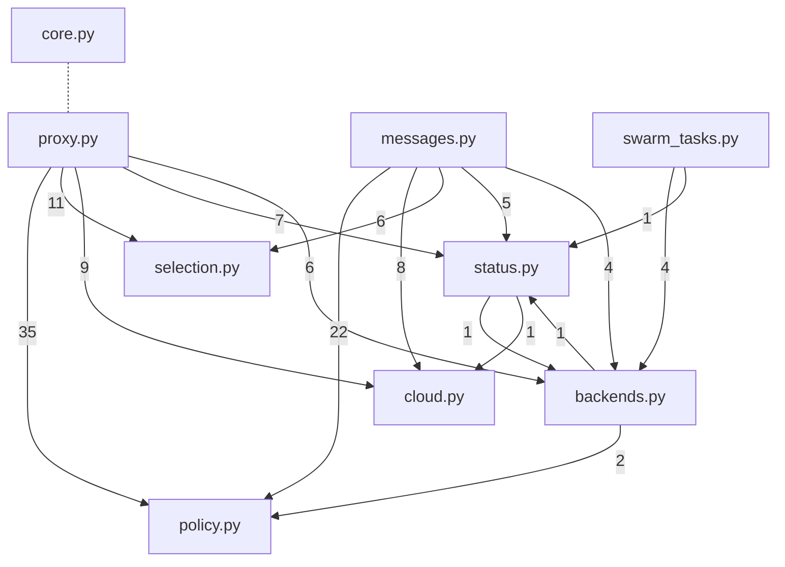
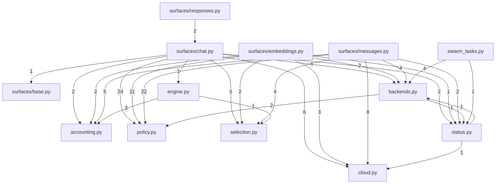
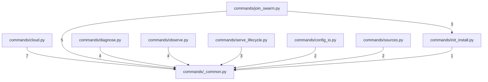

# AST Dependency Graph for the F-26 Split — validation of the proposed layouts

Companion to [module-inventory.md](module-inventory.md) (which proposes the layouts) and
[plan-f24-f26.md](plan-f24-f26.md) (which sequences the work). The inventory's clustering
was derived by reading; this document derives the same graph **mechanically from the AST**
and asks one question of each proposed module boundary: *does the graph support this cut?*

---

## 0. How to reproduce

Analyzer: [`scripts/analyze-module-graph.py`](../../../scripts/analyze-module-graph.py)
(stdlib `ast` only, no new dependencies, deterministic output).

```sh
# service.py — inventory 1.4 layout, then plan-f24-f26 section 1 layout
python3 scripts/analyze-module-graph.py --layout service-inventory \
    --file packages/netllm-agent/src/netllm_agent/service.py
python3 scripts/analyze-module-graph.py --layout service-plan \
    --file packages/netllm-agent/src/netllm_agent/service.py

# main.py — analyzed from the committed state (the worktree is mid-edit by Phase 1)
git show HEAD:packages/netllm-cli/src/netllm_cli/main.py > /tmp/main_HEAD.py
python3 scripts/analyze-module-graph.py --layout cli-inventory --file /tmp/main_HEAD.py

# add --format json for the full machine-readable report
```

> **Post-Phase 9 note.** `service.py` no longer exists — Phase 9 split it into
> `netllm_agent/service/`. To reproduce the tables below, read the pre-split file
> the same way `main.py` is read here:
> `git show <phase-8-commit>:packages/netllm-agent/src/netllm_agent/service.py > /tmp/service_pre.py`.
> The post-split graph is verified instead by
> [`scripts/check-service-split-mechanical.py`](../../../scripts/check-service-split-mechanical.py)
> (bodies unchanged) and by `tests/contract/test_patch_targets.py` (patch targets
> repointed). Both cycles this document flagged are gone: see §5, seams S1-S4.

**State analyzed:** commit `e8d4f5e` ("test(contract): phase 0a harness for the F-24/F-26
refactor"), branch `claude/refactor-f24-f26-consolidation`.
`git diff --stat HEAD` is empty for both target files, so the worktree `service.py`
(2,363 lines) and the `git show HEAD` `main.py` (2,181 lines) are both exactly `e8d4f5e`.

This is **not** the `64f14a4` the inventory used. The F-30..F-48 remediation has since
landed, so `service.py` gained three nodes the inventory does not list — module-level
`_token_count` (s:89), `AgentService._usage_from_sse_chunk` (s:210) and
`AgentService._record_stream_success` (s:249, the F-33 fix). All three are mapped in the
analyzer's cluster tables (cluster B / `status.py`, or `accounting.py` under the plan
layout). Every other node in both files is covered; the analyzer reports zero unmapped
nodes for all three layouts, which is itself a check that the inventory's clustering is
total.

---

## 1. `service.py` — headline numbers

| Metric | Value |
|---|---|
| Nodes (module-level defs, classes, methods) | 70 — 68 callables + 2 classes |
| Resolved internal call edges / call sites | 154 / 160 |
| Cross-cluster call sites (inventory layout) | 123 of 154 edges |
| External (unresolvable) call fan-out | 461 |
| Distinct `self.<attr>` touched | 22 |
| Shared-state groups (attr touched by more than one cluster) | 20 |
| ... of which have more than one writing cluster, excluding `__init__` | 3 |
| Module-global references (`logger`, `LEGACY_CLOUD_BACKEND_IDS`) | 12 |
| Cluster-level dependency cycles | **1** — `backends.py` and `status.py` |

### 1.1 Cluster graph — inventory 1.4 layout

Edge weight = number of call **sites** crossing the boundary.



`core.py` has no call edges at all (dashed, construction only); it is coupled purely
through state, which is why its cross-state count is the highest in the table below.

### 1.2 Cohesion table — inventory 1.4 layout

`cohesion = internal / (internal + out + in)`, counting distinct call edges.
`state` = cross-cluster state edges the cluster participates in (write-or-invoke on one
side, any touch on the other). `extfan` = unresolvable/external calls.

| Cluster | nodes | body LOC | internal | out | in | cohesion | state | extfan |
|---|---:|---:|---:|---:|---:|---:|---:|---:|
| `backends.py` | 5 | 170 | 3 | 3 | 15 | 0.143 | 30 | 35 |
| `cloud.py` | 7 | 262 | 0 | 0 | 18 | 0.000 | 16 | 61 |
| `core.py` | 3 | 83 | 0 | 0 | 0 | n/a | 66 | 12 |
| `messages.py` | 6 | 404 | 5 | 45 | 0 | 0.100 | 22 | 62 |
| `policy.py` | 15 | 197 | 3 | 0 | 59 | 0.048 | 25 | 47 |
| `proxy.py` | 8 | 438 | 4 | 68 | 0 | 0.056 | 20 | 81 |
| `selection.py` | 4 | 158 | 0 | 0 | 17 | 0.000 | 19 | 23 |
| `status.py` | 10 | 232 | 5 | 2 | 14 | 0.238 | 39 | 73 |
| `swarm_tasks.py` | 10 | 238 | 11 | 5 | 0 | 0.688 | 21 | 67 |

**Read the cohesion column carefully — low is not automatically bad here.** `policy.py`,
`selection.py` and `cloud.py` score near zero because they are *pure sinks*: 59, 17 and 18
inbound edges and **zero outbound**. That is the signature of a clean lower layer, not of a
bad cut. The clusters that would be alarming are ones with high out *and* high in; none
exist except the `backends.py`/`status.py` pair (see 1.4).

The graph is layered and almost acyclic:

```text
proxy.py, messages.py        (call into everything, called by nothing)
  -> policy.py, selection.py, cloud.py, backends.py, status.py
       -> core.py (state only)
swarm_tasks.py               (independent; only touches backends.py + status.py)
```

### 1.3 Cluster graph — plan-f24-f26 section 1 layout

Same graph re-clustered onto the plan's `engine.py` / `accounting.py` / `surfaces/*` shape.
This is a **projection**, not a measurement of the end state: `engine.py` and
`accounting.py` do not exist yet, so their contents here are only the existing methods the
plan says become them (`_stream_with_metrics` becomes the engine, the five telemetry
methods plus `_mark_backend_failure` become the recorder). Their real cohesion after
Phases 2 and 6-7 will be much higher, and the `surfaces/*` out-degrees much lower.

| Cluster | nodes | body LOC | internal | out | in | cohesion | state | extfan |
|---|---:|---:|---:|---:|---:|---:|---:|---:|
| `accounting.py` | 6 | 119 | 3 | 0 | 12 | 0.200 | 28 | 47 |
| `backends.py` | 5 | 170 | 3 | 3 | 15 | 0.143 | 34 | 35 |
| `cloud.py` | 7 | 262 | 0 | 0 | 18 | 0.000 | 20 | 61 |
| `core.py` | 3 | 83 | 0 | 0 | 0 | n/a | 72 | 12 |
| `engine.py` | 1 | 33 | 0 | 4 | 1 | 0.000 | 0 | 7 |
| `policy.py` | 15 | 197 | 3 | 0 | 59 | 0.048 | 29 | 47 |
| `selection.py` | 3 | 146 | 0 | 0 | 12 | 0.000 | 23 | 18 |
| `status.py` | 5 | 125 | 2 | 2 | 7 | 0.182 | 35 | 31 |
| `surfaces/base.py` | 2 | 25 | 0 | 0 | 1 | 0.000 | 0 | 7 |
| `surfaces/chat.py` | 2 | 230 | 0 | 45 | 2 | 0.000 | 26 | 39 |
| `surfaces/embeddings.py` | 1 | 121 | 0 | 21 | 0 | 0.000 | 26 | 22 |
| `surfaces/messages.py` | 6 | 404 | 5 | 45 | 0 | 0.100 | 28 | 62 |
| `surfaces/responses.py` | 2 | 29 | 0 | 2 | 0 | 0.000 | 0 | 6 |
| `swarm_tasks.py` | 10 | 238 | 11 | 5 | 0 | 0.688 | 21 | 67 |



The plan's extra structure is visible and correct in the graph: `surfaces/responses.py`
depends only on `surfaces/chat.py` (2 sites, matching "edge translation over ChatAdapter"),
`surfaces/base.py` is a leaf, and the engine's only dependencies are the recorder and
selection — exactly the anti-erosion property the plan wants to gate in CI. **But the
same `backends.py` and `status.py` cycle survives the re-clustering** (see 1.4).

### 1.4 The one cycle: `backends.py` and `status.py`

Both layouts contain the same 2-cycle, from exactly three edges:

| Direction | Edge | Site |
|---|---|---|
| `backends.py` -> `status.py` | `refresh_local_backends` -> `_update_health_metrics` | s:327 |
| `status.py` -> `backends.py` | `list_models_aggregated` -> `refresh_local_backends` | s:540 |
| `status.py` -> `cloud.py` | `list_models_aggregated` -> `_materialize_cloud_provider_backends` | s:541 |

Verified by reading the source: `refresh_local_backends` ends with
`self._update_health_metrics()` right after the pool prune (s:324-328), and
`list_models_aggregated` opens with `await self.refresh_local_backends()` followed by
`self._materialize_cloud_provider_backends()` (s:539-541).

Under a mixin composition this cycle does not fail at import time — which is exactly why it
is dangerous: it will be invisible until someone tries to make `backends.py` a real
collaborator object, and it silently blocks the later "collaborator extraction" the
inventory names as the follow-on step (1.4, "Collaborator extraction ... can follow later").

**Seam to extract first:** move `_update_health_metrics` out of `status.py`. It is a pure
derivation over `self.pool` with three callers — `backends.py` (s:327), `proxy.py`
(s:1286, s:1439) and `messages.py` (s:2053) — and *no* caller inside `status.py` itself.
Putting it in `backends.py` (inventory layout) or `accounting.py` (plan layout) removes the
only `backends -> status` edge and leaves `status -> backends` unidirectional. One method,
one move, cycle gone.

### 1.5 Shared-state groups (the real cut hazards)

22 instance attributes, 20 of them touched by more than one proposed cluster. Because
`__init__` writes all of them, "multiple writers" is reported both with and without the
constructor; only the non-constructor writers are cut hazards.

**Multi-writer across the cut (3 groups):**

| Attribute | Writing clusters (excluding `__init__`) | Other clusters touching | Verdict |
|---|---|---|---|
| `self._request_count` | `status.py` (s:276), `proxy.py` (s:1150, s:1419), `messages.py` (s:1776) | none — write-only counter | **Flag.** Three clusters own an increment of the same counter and nothing reads it. Resolved structurally by the plan's `AttemptRecorder` (Phase 2), which the plan already names as the sole writer of `_request_count`. Do not split before Phase 2, or the counter's three writers become three modules. |
| `self.config` | `core.py` (`apply_config`, s:336), `swarm_tasks.py` (`_maybe_follow_gateway` mutates `self.config.routing.default_strategy`) | read by `backends.py`, `cloud.py`, `messages.py`, `policy.py`, `status.py` | **Flag.** Two writers, five readers, seven clusters total — the widest group in the file. `apply_config` is the intended single write path (05-configuration-and-control-plane.md); the gateway-follow write bypasses it. Seam: route `_maybe_follow_gateway`'s runtime strategy adoption through an explicit `core` entry point (e.g. `apply_runtime_strategy(strategy)`) so `swarm_tasks.py` never mutates config state directly. |
| `self._local_scan_cache` | `backends.py` (s:216-233 region), `core.py` (`apply_config` invalidation) | none | **Minor flag.** The invalidation is a one-line reach-in from the constructor module into the backends module's private cache. Seam: expose `invalidate_local_scan_cache()` on `backends.py` and have `apply_config` call it. |

**Single-writer but wide (the ones a mixin split tolerates and a collaborator split will not):**

| Attribute | Writer | Read-only clusters |
|---|---|---|
| `self.pool` | `core.py` rebinds only | `backends`, `cloud`, `messages`, `policy`, `proxy`, `selection`, `status` |
| `self.swarm` | `core.py` rebinds only | `backends`, `status`, `swarm_tasks` |
| `self._scenario_counts`, `self._source_counts` | `policy.py` | `status.py` |
| `self._shardless_fallbacks` | `selection.py` | `status.py` |
| `self._source_in_flight` | `policy.py` | — |
| `self._upstream_cache` | `backends.py` | — |
| `self._mdns_advertiser`, `self._mdns_browser`, `self.startup_warnings` | `swarm_tasks.py` | — |
| `self._batch_ledger` | — | `selection.py` |
| `self.telemetry`, `self.draining` | — | `status.py` |

`self.pool` deserves its own line. AST rebinding says "one writer", but that is an
artifact: the pool is mutated through **method calls on the attribute**, which the analyzer
records separately. 17 distinct pool methods are invoked, from 7 clusters:

| Pool method | Invoking clusters |
|---|---|
| `mark_success` | `status.py` (s:260), `proxy.py` (s:1139, s:1408), `messages.py` (s:1765) |
| `mark_failure` | `selection.py` |
| `merge_backends` | `backends.py` (s:316), `cloud.py` (s:1628) |
| `prune_local_provider_rows`, `prune_peer_rows` | `backends.py` (s:319, s:323) |
| `prune_cloud_provider_rows` | `cloud.py` (s:1549, s:1633) |
| `acquire`, `release` | `proxy.py`, `messages.py` |
| `select_backend`, `backends_for_model`, `any_health_stale` | `selection.py` |
| `backend_by_id` | `cloud.py`, `selection.py` |
| `known_models`, `model_names_for`, `resolve_via_pool` | `policy.py` |
| `cached_online`, `is_healthy` | `status.py` |

Six of the seven clusters call a pool **mutator**. That is the true shape of the coupling
and the reason the plan's ordering matters: `AttemptRecorder` collapses `mark_success` and
`mark_failure` to one caller (Phase 2), and the engine collapses `acquire`/`release` to one
caller (Phases 6-7). Only `merge_backends` / `prune_*` remain split across two clusters
(`backends.py` and `cloud.py`), which is defensible — they are two independent *sources* of
rows, and the pool API already namespaces the prunes per source.

### 1.6 Module-globals and imports

Only two module-level globals are referenced from method bodies: `logger` (from
`messages`, `proxy`, `selection`, `swarm_tasks`) and `LEGACY_CLOUD_BACKEND_IDS` (from
`backends.py` only, despite its name suggesting `cloud.py` — worth a second look during the
move, but it is a single reference and not a boundary problem).

63 distinct imported symbols are used. The ones used by three or more proposed modules —
i.e. the ones that must appear in several new import lists — are `Backend` (8 modules),
`Any` (7), `Mapping` (5), `asyncio` (4), and the metrics trio `REQUESTS_TOTAL`,
`REQUEST_LATENCY`, `BACKEND_IN_FLIGHT` plus `json` (each in `messages`, `proxy`, `status`).
The metrics trio's three-way spread is the import-level fingerprint of the same accounting
duplication F-24 and F-33 describe; after Phase 2 it should appear in `accounting.py`
alone, and that is a cheap, greppable post-condition for the Phase 2 gate.

### 1.7 Validation verdict per proposed boundary — `service.py`

| Boundary | Supported by the graph? | Notes |
|---|---|---|
| `core.py` (A) | **Yes** | Zero call edges in or out. Pure state ownership. |
| `backends.py` (C + F) | **Flagged — cycle** | 3 out / 15 in, but participates in the only cycle in the file. Fix per 1.4 before any collaborator extraction. Also owns `_local_scan_cache`, reached into by `core.apply_config` (1.5). |
| `cloud.py` (J) | **Yes** | 18 in, 0 out. Textbook sink. Shares `pool.merge_backends`/`prune_*` with `backends.py`, which is acceptable (two row sources). |
| `policy.py` (G + E-utilities) | **Yes, but do it last** | 59 inbound edges, 0 outbound — the largest sink in the file. 57 of those inbound sites come from the five proxy prologues (see below). Cutting before F-24's `build_request_plan` lands means `proxy.py` and `messages.py` import 12 and 10 policy symbols each. |
| `selection.py` (H + `_mark_backend_failure`) | **Yes** | 17 in, 0 out. Note `_select_backend_for_request` is passed as a *bound-method reference* into `_offload_if_probing` at s:1107, 1225, 1376, 1847, 1958 — an intra-cluster reference under this layout, so the cut is clean. |
| `proxy.py` (I) | **Yes as a mixin; premature as a module** | 68 outbound edges, 0 inbound. Fine for a mixin; as a standalone module it is 68 import-level dependencies on five other modules. |
| `messages.py` (K) | **Same as `proxy.py`** | 45 outbound, 0 inbound, plus 5 internal. |
| `status.py` (D-minus-heartbeat + B) | **Flagged — cycle + mixed concerns** | The cluster combines a read-only status surface with the telemetry write sinks; the write sink (`_update_health_metrics`) is what creates the cycle. The plan layout's split into `status.py` + `accounting.py` is the better shape, and the graph agrees: it drops `status.py` from 10 nodes / 232 LOC to 5 / 125 and raises the recorder to 12 inbound / 0 outbound. |
| `swarm_tasks.py` (L + heartbeat/gateway) | **Yes — the strongest cluster** | Cohesion 0.688, the highest in the file; 11 internal edges, 5 outbound (4 of them to `refresh_local_backends`), 0 inbound. Only flag: the `self.config.routing.default_strategy` write (1.5). |
| Plan-only: `engine.py`, `accounting.py`, `surfaces/*` | **Yes, and strictly better than the inventory layout** | `surfaces/responses.py` -> `surfaces/chat.py` is the only surface-to-surface edge (2 sites); `engine.py` reaches only `accounting.py` and `selection.py`. Both are the properties the anti-erosion CI gate is meant to preserve. |

**The 5-prologue evidence.** Cross-cluster call sites from each proxy entry point into
`policy.py` are near-identical, which is F-24 stated as a graph fact:

| Entry point | -> policy | -> cloud | -> selection | -> backends | -> status |
|---|---:|---:|---:|---:|---:|
| `proxy_chat_completion` | 12 | 3 | 4 | 2 | 2 |
| `proxy_chat_completion_stream` | 12 | 3 | 2 | 2 | 1 |
| `proxy_embeddings` | 11 | 3 | 3 | 2 | 2 |
| `proxy_messages` | 10 | 3 | 2 | 1 | 0 |
| `proxy_messages_stream` | 10 | 3 | 3 | 1 | 3 |

57 of the 123 cross-cluster call sites in the whole file are these five prologues calling
`policy.py`. Collapsing them into one `build_request_plan()` call per surface (Phase 4)
removes roughly 45 percent of the file's cross-cluster coupling before the move happens.
**This is the single strongest graph-based argument for the plan's ordering** (F-24 first,
F-26 last) and it is quantitative, not stylistic.

---

## 2. `main.py` — headline numbers

Analyzed from `git show HEAD:packages/netllm-cli/src/netllm_cli/main.py` at `e8d4f5e`
(2,181 lines) because the worktree copy is being edited by the Phase 1 CLI-split agent.

| Metric | Value |
|---|---|
| Nodes (all module-level functions; no classes) | 49 |
| Resolved internal call edges / call sites | 50 / 52 |
| Cross-cluster call edges | 30 |
| External call fan-out | 781 |
| Instance state | **0** — there is none; nothing to share |
| Module-global references | 33 |
| Cluster-level dependency cycles | **0** |

### 2.1 Cluster graph — inventory 2.4 layout



### 2.2 Cohesion table — inventory 2.4 layout

| Cluster | nodes | body LOC | internal | out | in | cohesion | extfan |
|---|---:|---:|---:|---:|---:|---:|---:|
| `commands/_common.py` | 3 | 34 | 0 | 0 | 28 | 0.000 | 11 |
| `commands/cloud.py` | 9 | 297 | 6 | 7 | 0 | 0.462 | 126 |
| `commands/config_io.py` | 3 | 42 | 0 | 2 | 0 | 0.000 | 13 |
| `commands/diagnose.py` | 4 | 357 | 1 | 4 | 0 | 0.200 | 138 |
| `commands/init_install.py` | 10 | 237 | 10 | 1 | 2 | 0.769 | 76 |
| `commands/join_swarm.py` | 6 | 226 | 3 | 7 | 0 | 0.300 | 83 |
| `commands/observe.py` | 5 | 420 | 0 | 4 | 0 | 0.000 | 193 |
| `commands/serve_lifecycle.py` | 5 | 249 | 0 | 3 | 0 | 0.000 | 107 |
| `commands/sources.py` | 2 | 71 | 0 | 2 | 0 | 0.000 | 30 |
| `main.py` (residual wiring) | 2 | 15 | 0 | 0 | 0 | n/a | 4 |

`commands/observe.py`, `serve_lifecycle.py` and `sources.py` score 0.000 because their
commands genuinely do not call each other — each is a self-contained Typer command whose
work happens in `netllm_cli.ui`, `netllm_core.config` and `httpx` (hence the very high
external fan-out: `observe.py` alone makes 193 external calls). Zero internal cohesion in
a command module is the expected shape, not a defect.

### 2.3 Cross-cluster edges in full

There are only two shapes, and both were already identified in inventory 2.2:

- **28 sites into `commands/_common.py`** — 24 of them `_config_path_option` (every command
  that takes a `--config` option), 3 `_require_config` (`serve` s:972, `swarm_token` s:589,
  `gateway_enable` s:1440), 1 `_normalize_agent_url` (`join` s:529). `_common.py` is a pure
  sink: 28 in, 0 out.
- **3 sites `join_swarm.py` -> `init_install.py`** — `_apply_swarm_join_listen` ->
  `_listen_port_of` (s:574), and `swarm_token` -> `_join_command_for` (s:598, s:641).

That is 31 cross-cluster call sites in total — the complete cross-group coupling of a
2,181-line file. No cycles, no shared state.

### 2.4 The couplings the call graph does *not* show

Two boundary risks live in globals and imports rather than calls, and both are load-bearing
for Phase 1.

**(a) The `app` global is referenced from five future modules.** `app` (created at
`main.py:77`) is referenced by `commands/init_install.py`, `join_swarm.py`, `observe.py`,
`serve_lifecycle.py` and `diagnose.py` — via their `@app.command(...)` decorators. If those
modules keep decorating, each must `from netllm_cli.main import app` while `main.py` imports
them, which is a genuine import cycle at module load. The inventory already recommends the
fix ("each command module exposes plain functions; `main.py` registers them"); the graph
promotes that from a style preference to a **requirement**. The three sub-apps
(`config_app`, `cloud_app`, `sources_app`) are each referenced by exactly one cluster and
travel with it — no problem there.

**(b) Patch-target fan-out.** Today a test patching `netllm_cli.main.X` intercepts every
command, because there is one namespace. After the split, each of these names lives in
*several* module namespaces, and a single repointed patch only intercepts one of them:

| Name patched in tests today | Modules it will live in after the split |
|---|---|
| `scan_local_providers` | `diagnose`, `init_install`, `join_swarm`, `observe`, `serve_lifecycle` (5) |
| `asyncio` | `cloud`, `diagnose`, `init_install`, `join_swarm`, `observe`, `serve_lifecycle` (6) |
| `httpx` | `cloud`, `diagnose`, `join_swarm`, `observe` (4) |
| `global_cli_on_path` | `diagnose`, `init_install`, `observe`, `serve_lifecycle` (4) |
| `mdns_available` | `diagnose`, `observe`, `serve_lifecycle` (3) |
| `global_netllm_installed` | `diagnose`, `observe`, `serve_lifecycle` (3) |
| `control_socket_path` | `diagnose`, `serve_lifecycle` (2) |

Concretely: `patch("netllm_cli.main.mdns_available")` in `test_doctor_supervised_port.py`
currently covers both the doctor and the serve path; repointing it to
`netllm_cli.commands.diagnose.mdns_available` silently stops covering `serve`. The plan's
deny-grep plus one canary "per repointed family" is therefore **not sufficient** — the
canary must be per *(name, destination module)* pair, which is 27 pairs from the table
above, not 7. This is the most likely way Phase 1 passes CI while losing real coverage.

### 2.5 Validation verdict per proposed boundary — `main.py`

| Boundary | Supported? | Notes |
|---|---|---|
| `commands/_common.py` | **Yes** | 28 in, 0 out, 34 LOC. Perfect sink. |
| `commands/init_install.py` | **Yes — strongest cluster in either file** | cohesion 0.769, 10 internal edges. Its only inbound coupling is the 3 sites from `join_swarm`, exactly as the inventory predicted. |
| `commands/join_swarm.py` | **Yes** | cohesion 0.300; depends on `_common` (5) and `init_install` (3). Directed, acyclic. |
| `commands/observe.py` | **Yes** | No internal calls, no inbound. 420 LOC / 193 external calls makes it the heaviest module; if a size budget bites, `drain` + `status` split cleanly from `models` + `peers` + `env_shell` with zero edges to cut. |
| `commands/serve_lifecycle.py` | **Yes** | 3 edges to `_common`. `serve` and the `start`/`stop`/`restart` trio share no call edge — grouping them is a judgement call the graph neither supports nor contradicts. |
| `commands/diagnose.py` | **Yes** | 4 edges to `_common`, 1 internal (`test` -> `_test_anthropic_agent`). |
| `commands/cloud.py` | **Yes** | cohesion 0.462, 6 internal edges (the `_cloud_provider_id_or_exit` / `_fallback_order_line` helpers), 0 inbound. Fully self-contained with `cloud_app`. |
| `commands/config_io.py`, `commands/sources.py` | **Yes** | 2 edges each into `_common`; each owns its sub-app. |
| Residual `main.py` | **Yes, provided commands are registered rather than decorated** | See 2.4(a). |

**Verdict: the CLI layout survives the graph unmodified.** Zero cycles, zero shared state,
one 3-site cross-group helper edge that the inventory already flagged and already places
deliberately. The risk in Phase 1 is entirely in the test-namespace repointing (2.4b) and
the decorator-versus-registration decision (2.4a), not in the module boundaries.

---

## 3. Revisions recommended to the inventory / plan layout

The layouts largely hold. Four concrete, evidence-backed changes:

1. **Move `_update_health_metrics` out of `status.py`** (into `backends.py` for the
   inventory layout, or `accounting.py` for the plan layout). It is the sole cause of the
   only dependency cycle in `service.py`, it has no caller inside `status.py`, and it is a
   one-method move. Without it, `status.py` and `backends.py` are mutually dependent in
   both proposed layouts, which blocks the collaborator extraction the inventory names as
   the follow-on step. Evidence: s:327 versus s:540-541; analyzer reports
   `two_cycles: [["backends.py", "status.py"]]` for `service-inventory` and `service-plan`
   alike.

2. **Give `_maybe_follow_gateway` an explicit config write path.** It mutates
   `self.config.routing.default_strategy` directly, making `swarm_tasks.py` a second writer
   of the widest shared-state group in the file (`self.config`: 2 writers, 5 readers, 7
   clusters). `apply_config` in `core.py` is the documented single write path. Add a narrow
   `core` entry point and have the gateway-follow call it; otherwise the split converts an
   in-class shortcut into a cross-module reach-in.

3. **Prefer the plan's `status.py` + `accounting.py` split over the inventory's combined
   `status.py`.** The graph supports the finer cut on the numbers: the combined cluster is
   10 nodes / 232 LOC with 5 internal, 2 out and 14 in and 39 cross-cluster state edges,
   mixing a read-only status surface with the telemetry write sinks. Split, `status.py`
   becomes 5 nodes / 125 LOC and the recorder becomes a clean 12-in / 0-out sink. Where the
   two documents disagree on this boundary, the plan is right and the inventory's 1.4 table
   should be amended to match.

4. **Strengthen the Phase 1 canary rule from per-name to per-(name, module).** Inventory
   2.3 and plan Phase 1 both count "12 patch sites" / "one canary per repointed family".
   The graph shows 7 patched names landing in 27 distinct (name, module) pairs, with
   `scan_local_providers` in 5 modules and `asyncio` in 6. A per-family canary can pass
   while a repointed patch has stopped intercepting the command a test actually exercises.

Everything else stands. In particular: the CLI clustering needs **no** change (2.5); the
service clustering of `policy.py`, `selection.py`, `cloud.py`, `core.py` and
`swarm_tasks.py` is confirmed by cohesion and direction; and the plan's ordering — F-24
before F-26 — is quantitatively justified by the 57-of-123 prologue figure in 1.7.

---

## 4. Analyzer limitations — read before trusting a number here

The analyzer is a single-pass AST walk with no type inference. Specifically:

- **Dynamic dispatch is invisible.** `getattr(self, name)()`, dispatch dicts, and callables
  stored in attributes are counted as external fan-out, not as call edges. The 461 external
  calls in `service.py` and 781 in `main.py` are not analyzed further.
- **Bound-method references are treated as call edges.** `self._select_backend_for_request`
  passed to `_offload_if_probing` (s:1107 and four siblings) counts as a dependency on that
  method. That is the intent, but it means "call edge" really means "static reference".
- **Aliasing defeats it.** `fn = self.foo; fn()` resolves to nothing.
- **Decorators are only scanned for name references**, not followed. A decorator that
  wraps or re-registers a function contributes no edge. This matters for the Typer commands
  in `main.py`, where `@app.command()` is the actual registration mechanism.
- **Mixin/MRO composition is not modelled.** `self.foo()` resolves against methods
  syntactically present in the *same class body*. After the split into mixins, the same
  analysis would need the composition table; the numbers here are for the pre-split file.
- **Reads versus mutation on an attribute cannot be distinguished.** `self.pool.acquire()`
  is recorded as a read of `self.pool` plus an invocation of `acquire`. Section 1.5 reports
  invoked methods per cluster precisely because "who writes `self.pool`" is unanswerable
  from the AST alone; deciding which of the 17 pool methods mutate is a human judgement
  applied on top of the analyzer's factual method list.
- **Nested attribute writes are attributed to the root.**
  `self.config.routing.default_strategy = x` is recorded as a write to `self.config`. That
  is the right call for cut analysis but overstates the write if you read it as a rebind.
- **Non-`self` receivers are ignored entirely**, as are cross-module edges — this tool
  analyzes one file at a time and says nothing about `app.py`, `admin.py` or the tests.
  Inventory 1.3 and 2.3 remain the authority on external constraints.
- **Cohesion is a ratio of edge counts, not a quality score.** A pure sink scores 0.000 and
  is a good module; a cluster with high in *and* high out scores well and is a bad module.
  Read the direction columns, not the ratio, when judging a boundary.

### Self-verification performed

- The analyzer was run twice per layout (`service-inventory`, `service-plan`,
  `cli-inventory`) with `--format json`; output was byte-identical each time, and again
  after `ruff format`. `ruff check` and `ruff format --check` pass on the script.
- Six call edges were hand-checked against the source: `refresh_local_backends` ->
  `_update_health_metrics` (s:327), `list_models_aggregated` -> `refresh_local_backends`
  and -> `_materialize_cloud_provider_backends` (s:540-541), `_peer_forward_headers` ->
  `_normalize_headers` (s:748), `proxy_chat_completion` -> `_select_backend_for_request`
  as a bound reference through `_offload_if_probing` (s:1106-1107), and
  `proxy_messages_stream` -> `_record_stream_success` (s:2010).
- Two shared-state groups were hand-checked: `self._request_count` (writes confirmed at
  s:132 constructor, s:276, s:1150, s:1419, s:1776 — three non-constructor clusters) and
  `self.pool` mutator spread (`mark_success` at s:260, s:1139, s:1408, s:1765;
  `merge_backends` at s:316 and s:1628; `prune_*` at s:319, s:323, s:1549, s:1633).
